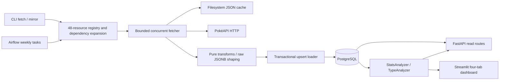

# Project Audit Report

> This report records the pre-remediation audit of revision `48444e9502fea96fc01086e64a6a211e63470993`. See [REMEDIATION_STATUS.md](REMEDIATION_STATUS.md) for the current uncommitted fix status and remaining verification.

## 1. Executive Summary

This repository is a Python 3.14 Pokémon analytics platform with a registry-driven PokéAPI mirror, PostgreSQL storage, an Airflow DAG, six read-only FastAPI routes, and a four-tab Streamlit dashboard. Its modular ingestion/transform/load boundaries and transactional fan-out are sound foundations. It is not ready for an unattended production rollout in its current configuration.

The immediate priorities are secret-file inclusion in Docker images, known template administrator credentials, a missing database upgrade path, and mirror runs that can be stale or incomplete while reporting success. Upserts also retain deleted relationships. A normal empty effectiveness dataset crashes dashboard execution before the individual-analysis controls render.

Existing checks are green: 30 tests, Ruff lint/format, mypy, lockfile validation, and Python wheel/source-distribution build. This does not establish deployment readiness: existing tests leave API, analytics, UI and DAG code uncovered, and use SQLite without FK enforcement. Docker was unavailable, so no image build or full PostgreSQL/Airflow stack was exercised.

The requested UI/UX Taste framework could not be located. A skill literally named `taste` was found and fully read, but it is for music-video creative direction, not interface evaluation. **Taste UI/UX Skill was not successfully used.** The authorized manual fallback covered all four dashboard tabs at four widths with isolated synthetic data, plus empty and database-error states. It found a mobile heatmap readability defect, a misleading generation filter, inadequate failure recovery, and missing complete data alternatives. Those observations are not attributed to Taste.

**Finding counts:** 0 Critical, 7 High, 21 Medium, 4 Low, 1 Informational. Severity reflects this repository’s demonstrated impact and deployment assumptions, not scanner CVSS alone. No Critical finding was established. Do not interpret that as a security certification.

## 2. Audit Scope & Methodology

### Engineering Audit Methodology

Inspected all 52 tracked files at the revision below: 27 source Python modules, six test files, SQL/schema/init scripts, both Dockerfiles and Compose files, root tooling/configuration, lockfile, CI, README and two design documents. Empty package initializers were included. Traced CLI/DAG ingestion, API query paths, analytics and dashboard reruns. Compared models against SQL and the earlier Git revision; searched exception handling, configuration, lifecycle ownership, suppressions and unfinished work. No application code or tests were modified.

Used targeted in-memory/file-backed SQLite probes and httpx mocks for behavior that did not require PostgreSQL. Read the existing public PokéAPI cache to quantify workload and verify form/move examples; did not mutate or refresh that cache. Read installed framework source for Airflow routing. Preserved existing Git state; it was clean at audit start.

### Security Audit Methodology

Threat boundaries considered: unauthenticated public-data readers, network-accessible Airflow administration, operators/DAG authors, upstream HTTP responses/cache files, container images, CI runners and shared database credentials. Traced all six custom routes individually. Checked SQL parameter binding, absence/presence of write surfaces, source URL handling, cache path safety, secret propagation, role separation and deployment ingress. Ran redacted history secret scanning and a frozen all-extras runtime dependency audit. No production requests, credential guessing, exploitation, migrations or deployment actions were performed.

### Taste Skill UI/UX Methodology

Searched installed Codex/Agents skill roots, plugin caches, the workspace/Personal tree and Claude skill locations, including symlink-aware searches. Fully read `/Users/admin/.claude/plugins/marketplaces/everything-claude-code/skills/taste/SKILL.md`. That file prescribes angelcore/hyperpop music-video mood, beat timing and rendering, not UI/UX review. Other taste-named matches were gstack test/update utilities, not the requested skill. It would be misleading to apply a music-video rubric to this analytics UI or claim completion of a Taste interface review.

Accordingly, **applicable Taste UI/UX Skill available: no; used: no**. Manual fallback was explicitly allowed by the request. Findings label whether evidence is source-confirmed, runtime-confirmed, or requires manual verification. No recommendation to impose the unrelated video aesthetic was made. The available agent-browser instructions were read, but its executable was absent; browser inspection used Playwright with locally installed Chrome.

### Runtime / Browser Inspection Performed

- Locally started Streamlit 1.58.0 at loopback-only ports, with no connection to the configured real database.
- Populated fixture: real dashboard source and analyzers over temporary SQLite with five Pokémon and 18 synthetic types. Only the two PostgreSQL-specific stats methods (dual-type aggregation and move-coverage query) returned fixture DataFrames. Other queries/interactions executed against the temporary database. Synthetic effectiveness/stat values are not domain-truth validation.
- Empty fixture: empty schema with the same two dialect-specific methods stubbed; actual type ranking code raised its error.
- Database outage: unmodified dashboard with a deliberately closed loopback PostgreSQL port and dummy credentials. This tested connection-failure presentation without contacting a database.
- Used actual browser tab/filter interactions; captured screenshots for all four tabs at 390×900, 768×900, 1440×1000 and 1920×900. Visually inspected representative desktop/mobile images and DOM text/width measurements. Keyboard ArrowRight/Enter successfully changed the selected tab. No body overflow was measured at those widths.
- Tested repeated runs with Streamlit AppTest; observed growing checked-out connection counts. Tested custom APIs through FastAPI TestClient with dependency override, not a live PostgreSQL-backed server.
- Airflow admin UI, authenticated role journeys, production HTTP ingress, real devices, screen readers and the full live dataset in PostgreSQL were not inspected. Temporary screenshots/scripts/databases were cleaned after evidence was summarized here; this report is the persistent deliverable.

## 3. Repository Overview

| Area | Implementation / responsibility |
|---|---|
| Language/runtime | Python >=3.14,<3.15; local interpreter 3.14.4; uv + Hatchling |
| API/CLI | `src/main.py`; FastAPI/Uvicorn, production Gunicorn; fetch/mirror/analytics subcommands |
| Ingestion | `api_client.py`, `resource_fetcher.py`, `resources.py`, `mirror.py`; httpx, tenacity, bounded thread pool, filesystem JSON cache |
| Domain projection | Pure functions in `core_transformers.py`, `mirror_transformers.py`, URL-ID utility |
| Persistence | SQLAlchemy 2; psycopg2; PostgreSQL 18 image; 25 domain tables (9 core + 15 relational mirror + JSONB store), plus migration bookkeeping |
| Orchestration | Airflow 3.2.2 LocalExecutor; one weekly DAG, 48 tasks and 14 dependency edges |
| UI | Streamlit + Plotly + pandas; one route with four tabs; direct database access, not FastAPI consumption |
| Identity | No custom user/session model; Airflow FAB administrator/auth manager; shared JWT/Fernet config |
| Infrastructure | Development and production Docker Compose; no Kubernetes/Terraform/cloud deployment configuration |
| Tests | pytest/pytest-httpx/pytest-cov; SQLite fixtures; Ruff and mypy |
| Observability | Python logs, Airflow logs and limited container healthchecks; no application metrics/tracing stack |
| External integration | Public PokéAPI HTTP; no payment, email, upload, object-storage, webhook or tenant workflow |

Locked examples: FastAPI 0.137.2, SQLAlchemy 2.0.51, Streamlit 1.58.0, httpx 0.28.1, Airflow 3.2.2. These were read from the lockfile/local metadata, not inferred from minimum constraints.

## 4. System Architecture

The CLI expands transitive dependencies; DAG tasks pass `expand_deps=False` because edges enforce parent-before-child ordering. Core Pokémon data fans out into five tables, type into two. Resource transactions are atomic at the loader stage; the entire 48-resource mirror is not one transaction. Raw JSONB and relational resources take mutually exclusive branches.

SQLAlchemy engine/session factory is initialized when models are imported after dotenv loading. FastAPI injects and closes request sessions; CLI analytics uses session_scope. Streamlit owns two analyzer sessions without closing them. Airflow code imports the same registry/engine and uses LocalExecutor subprocesses. No separate message broker or external queue is involved.

## 5. Architecture Assessment

The registry is an appropriate simplification for this scale: adding a resource has a clear declaration, transform and model boundary, with shared fetch/load behavior. Frozen resource dataclasses and explicit dependency ordering are understandable. There is no evidence that microservices, a new frontend framework or a broad rewrite would improve the immediate problems.

The weakest architectural contract is what “mirror complete” means. Completeness, source freshness, provenance, deletion reconciliation and transaction publication are not modeled together. Consumers read mutable tables without a successful-snapshot/run marker. The UI bypasses the API by design, so validation/analytics consistency must live in shared domain methods rather than only route handlers.

Other maintenance costs are schema duplication (SQL vs ORM), separately pinned Airflow image dependencies, configuration composition split between Python/Compose/Make, and duplicated generation logic inside the 275-line dashboard. Scaling pressure is concentrated in whole-resource buffering, repeated dashboard queries and resource lifetime management. Fix these boundaries before adding architectural layers.

## 6. Critical Findings

No Critical finding established. Image-secret exposure and default administrative credentials are High because the source proves dangerous defaults/propagation, but no actual distributed image compromise or externally reachable live deployment was demonstrated.

## 7. High-Severity Findings

### AUDIT-SEC-001 — Application image copies the local secret file

**Severity:** High  
**Confidence:** High  
**Category:** Security / Secrets

**Location:** `docker/Dockerfile.app:23-31`; `.dockerignore:1-33`; `Makefile:95-108`

**Description:** The build context is the repository root and `COPY . .` includes `.env`. The Docker ignore file excludes virtual environments and caches but not `.env` or other secret files. Git ignore rules do not protect Docker build context.

**Evidence:** The documented startup creates `.env` before building. A local `.env` exists; its contents were not printed. Source inspection establishes inclusion even though a container build could not be run. The same application image serves API and Streamlit.

**Impact:** Database credentials, Airflow encryption material, and JWT signing material can become persistent image-layer contents and be exposed to anyone able to pull/export the image.

**Example failure scenario:** Run the documented startup with real credentials, then distribute the resulting application image. `/app/.env` travels with the image.

**Recommendation:** Exclude secret files from Docker context, use an explicit source allowlist, and add an image-content check using dummy secrets. Determine whether existing images were distributed before deciding on credential rotation; no rotation was performed in this audit. Docker documents context exclusions in [Build context](https://docs.docker.com/build/concepts/context/#dockerignore-files).

**Remediation effort:** Small

### AUDIT-SEC-002 — Production bootstrap accepts publicly known template passwords

**Severity:** High  
**Confidence:** High  
**Category:** Security / Deployment

**Location:** `.env.example:10-13,31-36`; `Makefile:97-108`; `docker/docker-compose.prod.yml:122-123,153-160`

**Description:** The template includes static database and administrator passwords. `_env` randomizes only Fernet/JWT keys. Production checks require nonempty passwords, so copied template values satisfy those checks. Airflow is published on all host interfaces.

**Evidence:** Trace: `make start ENV=prod` → copy template → generate two keys → Compose required-variable substitution → `airflow users create -r Admin`. No validation rejects the template passwords. Password values are intentionally omitted: `SECRET=[REDACTED]`.

**Impact:** A fresh deployment may expose an administrative Airflow account with a known password. Host/network controls can reduce exposure but none are supplied in this repository.

**Example failure scenario:** An operator follows quick start without editing credentials and the host is reachable by another user on the network.

**Recommendation:** Use separate production configuration with no template passwords; require explicit administrator setup or generate a unique one-time credential. Limit management-interface binding and document the intended ingress/authentication boundary.

**Remediation effort:** Small

### AUDIT-DATA-001 — Weekly mirror never refreshes successful cached responses

**Severity:** High  
**Confidence:** High  
**Category:** Data freshness / Correctness

**Location:** `src/ingestion/api_client.py:73-101,148-164`; `src/ingestion/resource_fetcher.py:32-40`; `src/dags/pokeapi_mirror.py:41-49`; `src/loading/resource_loader.py:105-111`

**Description:** Cache entries have no TTL, validators, source namespace, or run-level refresh control. Resource lists and details both use the cache by default. Weekly scheduling therefore reimports an old snapshot indefinitely. JSONB `fetched_at` is updated during reload, concealing the age of the underlying HTTP fetch.

**Evidence:** An isolated cache file with filesystem time set to epoch second 1 was returned as a hit. A second client with a different base URL read the same cached entry. The mirror/CLI never forwards `use_cache=False`.

**Impact:** New IDs are never discovered after a list is cached; corrections remain invisible; timestamps can falsely imply fresh data. Changing upstream environments can reuse the wrong source data.

**Example failure scenario:** Cache a resource list on the first run. Upstream adds a record. Every subsequent weekly run reads the original list and reports completion without seeing the addition.

**Recommendation:** Introduce an explicit freshness policy, origin-aware cache keys, TTL or conditional HTTP requests, and CLI/DAG refresh controls. Preserve separate source-fetched and database-loaded timestamps. Test changed lists and changed details.

**Remediation effort:** Medium

### AUDIT-DATA-002 — Upserts never remove relationships absent from a new snapshot

**Severity:** High  
**Confidence:** High  
**Category:** Database / Reconciliation

**Location:** `src/ingestion/mirror.py:49-73`; `src/loading/resource_loader.py:44-80`; `src/transformation/core_transformers.py:43-136`

**Description:** Every relational synchronization is insert-or-update only. No step reconciles deleted type slots, abilities, moves, stats, or type-effectiveness edges. This is especially wrong for effectiveness: absence is explicitly defined as neutral, but a previous non-neutral edge remains.

**Evidence:** An isolated database contained a normal→ghost edge. Re-ingesting a type response with all damage-relation arrays empty left the old edge in place (count remained 1). No cleanup safeguard exists in the loader or database schema.

**Impact:** Analytics can retain obsolete weaknesses, types, abilities and move availability even after cache refresh is repaired. Parent upserts are idempotent but do not implement snapshot synchronization.

**Example failure scenario:** A two-type Pokémon becomes single-type upstream. Slot 1 updates; the old slot 2 is never deleted and still multiplies the weakness profile.

**Recommendation:** For each successfully fetched complete parent, transactionally replace/reconcile its authoritative child set. Handle resource deletions only after a complete validated snapshot. Do not interpret failed/missing fetches as deletions. Add removal and partial-run regression cases.

**Remediation effort:** Medium

### AUDIT-REL-001 — Incomplete and entirely failed resources are reported as successful

**Severity:** High  
**Confidence:** High  
**Category:** Reliability / Orchestration

**Location:** `src/ingestion/resource_fetcher.py:42-83`; `src/ingestion/mirror.py:35-93`; `src/dags/pokeapi_mirror.py:32-34`

**Description:** Detail errors and transformation exceptions are logged then skipped. The engine returns only success counts, and the DAG callable does not inspect completeness. Even zero valid records can finish successfully, so Airflow task retries are bypassed for these failures.

**Evidence:** An isolated run containing one malformed type returned `{'type': 0}` without raising. Existing tests intentionally enforce skipping malformed/failing records. Loader failures do raise; this finding concerns the earlier fetch/transform failures.

**Impact:** Consumers cannot distinguish a complete mirror from a partial one. Missing parent records may later break FK loads; missing leaf/JSONB records may remain unnoticed indefinitely.

**Example failure scenario:** Every detail request for a leaf resource exhausts HTTP retries. The fetcher yields nothing, the loader does nothing, and the Airflow task becomes successful.

**Recommendation:** Return attempted/succeeded/failed counts and failed IDs; default scheduled jobs to strict completion or an explicit error budget. Raise a domain exception when incomplete, preserve failed records for retry, and publish run status/freshness metrics.

**Remediation effort:** Medium

### AUDIT-DB-001 — Existing databases have no viable schema upgrade path

**Severity:** High  
**Confidence:** High  
**Category:** Database / Upgrades

**Location:** `database/initdb/init.sh:4-35`; `database/initdb/schema.sql:10-256`; `database/migrations/versions/001_initial_schema.sql:1-9`; `docker/docker-compose.prod.yml:27-37`

**Description:** All schema evolution was folded into `CREATE TABLE IF NOT EXISTS` startup SQL. The sole numbered migration is now a no-op. Init scripts run on an empty PostgreSQL data directory, not each deployment; even manually rerunning this script does not add columns/constraints to existing tables.

**Evidence:** Historical revision `f0c6525` defines `pokemon` without `is_default` and `order_num` in its initial migration. Current transformers write both. There is no ALTER migration or deployment migration service for application tables. Airflow `db migrate` upgrades only Airflow metadata.

**Impact:** An existing volume can remain incompatible with current loaders/API. A deployment can fail after apparently successful startup. Manual destructive recreation would risk data loss and is not an acceptable upgrade procedure.

**Example failure scenario:** Reuse a database initialized by the earlier revision; deploy this revision; Pokémon upsert references columns that the old table never gained.

**Recommendation:** Add versioned, transactional forward migrations with an explicit upgrade command/service and backup/rollback guidance. Test both empty initialization and upgrade from the prior schema. Keep application migration ownership separate from Airflow metadata. Official image behavior: [PostgreSQL image initialization](https://hub.docker.com/_/postgres).

**Remediation effort:** Medium

### AUDIT-UX-001 — Empty effectiveness data aborts dashboard execution

**Severity:** High  
**Confidence:** High  
**Category:** Correctness / UX fallback review

**Location:** `src/analytics/type_analyzer.py:61-129`; `src/analytics/dashboard.py:99-145`

**Description:** Ranking methods build a DataFrame from an empty list, then sort by columns that do not exist. The dashboard calls these methods after displaying the empty matrix message, before rendering the Individual Pokémon Analyzer controls.

**Evidence:** Direct analyzer invocation raised `KeyError: super_effective_count`. Browser inspection of an empty SQLite fixture reproduced the traceback on `/` while Top Pokémon Stats was selected; the later analyzer controls were never created. Two PostgreSQL-specific stats methods were stubbed only to reach this path. This is runtime/source evidence from the manual fallback, not Taste Skill.

**Impact:** A normal first-use or partially ingested state prevents completion of a core journey. CLI `analytics --type types` has the same failure. Earlier tab content can still render, so this is not a claim that every pixel disappears.

**Example failure scenario:** Initialize schema, open the dashboard before types/effectiveness are loaded, then attempt Individual Pokémon Analysis.

**Recommendation:** Return typed empty DataFrames or short-circuit ranking methods. Render an actionable first-run state with ingestion prerequisites and isolate each tab’s failure boundary. Add empty/partial database integration and dashboard tests.

**Remediation effort:** Small

## 8. Medium-Severity Findings

### AUDIT-DATA-003 — Relational resources discard nested source data rather than retaining it in JSONB

**Severity:** Medium  
**Confidence:** High  
**Category:** Data fidelity / Architecture

**Location:** `src/ingestion/resources.py:58-113`; `src/ingestion/mirror.py:38-87`; `src/transformation/mirror_transformers.py:1-6,131-170`; `docs/superpowers/specs/2026-06-19-pokeapi-full-mirror-design.md:18-24`

**Description:** The design says relational resources keep nested detail in JSON. The registry selects one mode, however, and relational branches never call `load_jsonb`. Nested species, item, nature and other fields omitted by transforms are not retained in PostgreSQL.

**Evidence:** `transform_pokemon_species` emits selected scalars but omits arrays such as varieties and egg_groups. A relational resource is not also registered as JSONB. On-disk HTTP cache is the only raw copy and is excluded from the database backup boundary.

**Impact:** The database is a selective projection, not a faithful full mirror. New analytics cannot recover missing fields from PostgreSQL alone.

**Example failure scenario:** A consumer tries to relate species varieties or egg groups using the mirrored database after the cache is unavailable.

**Recommendation:** Store the raw response for every resource alongside projections, or explicitly redefine and document the product as a lossy projection. Make source provenance/freshness queryable.

**Remediation effort:** Medium

### AUDIT-DATA-004 — Move selection mixes versions and loses learning-level provenance

**Severity:** Medium  
**Confidence:** High  
**Category:** Domain logic / Move provenance

**Location:** `src/transformation/core_transformers.py:10,96-130`; `src/models/move.py:28-36`

**Description:** The preferred version group is selected independently for each move, not for the Pokémon or analysis. A move absent in the preferred version can be imported from an older fallback, and neither version group nor all learning levels are stored.

**Evidence:** The `target_vg` choice is inside the per-move loop. The key contains only Pokémon, move and learn method; `seen_methods` keeps the first matching detail. A source comment already acknowledges level ambiguity.

**Impact:** A reported move set can combine games in which that complete move set never existed. Data order can alter the retained level. Coverage statistics cannot be scoped to a game.

**Example failure scenario:** One move is present in scarlet-violet and another only in an older version. Both are returned as a single unqualified move set.

**Recommendation:** Preserve version-group ID and learning-level identity in normalized rows/raw data; select the requested game consistently at query time. If a cross-game union is intentional, name it explicitly and do not imply current-game availability.

**Remediation effort:** Medium

### AUDIT-LOGIC-001 — Generation filter treats alternate-form IDs as species numbers

**Severity:** Medium  
**Confidence:** High  
**Category:** Domain logic / Frontend integration

**Location:** `src/analytics/dashboard.py:147-227`; `src/models/pokemon.py:11-19`; `src/models/mirror.py:124-145`

**Description:** Generation is inferred twice from Pokémon resource ID thresholds. Alternate forms have separate high IDs, so they fall into Generation IX regardless of the underlying species. The separate species table has generation_id, but Pokémon has no species reference.

**Evidence:** Existing local public-data cache identifies ID 10001 as deoxys-attack with species deoxys. The browser fixture placed it under “Generation IX and newer”. The filtering outcome is confirmed; fixture chart values were synthetic.

**Impact:** Generation selection excludes matching forms from the correct generation and misrepresents the catalog.

**Example failure scenario:** Select Generation IX; an older species’ alternate form appears solely because its resource ID is large.

**Recommendation:** Persist Pokémon→species and join species→generation for filtering. Define whether the UI means species debut or form debut; remove duplicate hard-coded threshold logic.

**Remediation effort:** Medium

### AUDIT-LOGIC-002 — Sparse type matrix omits types with only neutral relationships

**Severity:** Medium  
**Confidence:** High  
**Category:** Analytics / Correctness

**Location:** `src/analytics/type_analyzer.py:35-56,68-88,100-126,159-172`

**Description:** The matrix axes come only from existing non-neutral relationship rows. Filling NaNs does not introduce entirely absent attacking rows or defending columns.

**Evidence:** With three types and a single normal→ghost edge, the matrix contained only normal on its index and ghost on its columns. The third all-neutral type disappeared entirely.

**Impact:** Rankings and weakness profiles silently omit valid types; averages use different populations when data is incomplete.

**Example failure scenario:** Load a type with no non-neutral outgoing edges, or receive a partial relationship set. That attacking type never appears in profiles.

**Recommendation:** Build both axes from the authoritative `types` table, initialize to 1.0, then overlay edges. Explicitly scope nonstandard types if desired, and mark incomplete source snapshots separately.

**Remediation effort:** Small

### AUDIT-LOGIC-003 — Coverage counts learn-method rows as moves and exposes fractions as percentages

**Severity:** Medium  
**Confidence:** High  
**Category:** Analytics / Metric semantics

**Location:** `src/analytics/stats_analyzer.py:116-148`; `src/analytics/dashboard.py:54-60`; `src/models/move.py:28-36`

**Description:** `COUNT(m.id)` counts joined PokémonMove rows, whose key includes learn_method, so one move learned two ways counts twice. `type_coverage_pct` returns a 0–1 fraction and the dashboard displays the raw value without percentage formatting.

**Evidence:** Existing cached Alakazam data produced 118 method rows but 111 distinct moves. The browser fixture showed fractional coverage in an unformatted data table. The fraction follows directly from the SQL expression; PostgreSQL execution was not available.

**Impact:** Total-move values and ranking tie-breaks are biased by learning methods. Readers can interpret a displayed 0.94 percentage as 0.94% instead of 94%.

**Example failure scenario:** A Pokémon with two methods for one move outranks an otherwise equal Pokémon because the duplicated move increases total_moves.

**Recommendation:** Count distinct move IDs, define whether coverage means type diversity or damaging coverage, and name/format ratios consistently. Add metric-level tests with duplicate methods.

**Remediation effort:** Small

### AUDIT-API-001 — Analytics query bounds and not-found semantics are inconsistent

**Severity:** Medium  
**Confidence:** High  
**Category:** API / Validation

**Location:** `src/main.py:38-42,67-113,116-134`; `src/analytics/type_analyzer.py:151-157,208-213`

**Description:** The list endpoint bounds pagination, but top-pokemon accepts negative or arbitrarily large limit and counters accepts negative top_n. Missing Pokémon produces 404 in detail but 200/empty counters in analytics, indistinguishable from a valid Pokémon with no counters.

**Evidence:** FastAPI TestClient with isolated SQLite accepted limit=1000000 and limit=-1; the latter is not a PostgreSQL runtime result. The same nonexistent ID returned 404 for detail and 200 for counters. Negative pandas `head` excludes tail rows rather than validating the request.

**Impact:** Unexpected query work, confusing contracts, and avoidable database errors. On PostgreSQL a negative LIMIT is invalid; that specific production response still needs integration verification.

**Example failure scenario:** A client supplies top_n=-1 expecting a validation error but receives all but the last counter.

**Recommendation:** Apply explicit Query/Path bounds across endpoints, verify entity existence, and distinguish missing data from an empty valid result. Add response schemas and negative API contract tests.

**Remediation effort:** Small

### AUDIT-RES-001 — Dashboard sessions and internally owned clients have no deterministic cleanup

**Severity:** Medium  
**Confidence:** High  
**Category:** Resource management / Reliability

**Location:** `src/analytics/dashboard.py:20-22,139-141`; `src/analytics/stats_analyzer.py:17-25`; `src/analytics/type_analyzer.py:18-25`; `src/ingestion/mirror.py:28-93`; `src/ingestion/api_client.py:49`; `src/loading/resource_loader.py:25-26`

**Description:** Each dashboard run constructs two analyzers that own sessions; neither is closed. Mirror-created sessions and the httpx client also lack lifecycle cleanup. The correctly implemented get_db/session_scope helpers are not used in these paths.

**Evidence:** Four normal Streamlit AppTest reruns against the file-backed SQLite fixture left 2, 4, 6 and 8 connections checked out. No GC disabling was used. Eventual garbage collection may release them, so a permanent leak or production outage is not claimed.

**Impact:** Connection pressure and idle transactions can grow during interactions; under concurrency callers can wait for the pool. HTTP connections depend on GC/process termination.

**Example failure scenario:** A user repeatedly changes generation/Pokémon and causes fresh analyzers to be created while old sessions await collection.

**Recommendation:** Inject one scoped session per run, close internally owned sessions/HTTP clients in finally/context managers, and leave externally owned resources with their caller. Regression-test checked-out connections returning to baseline after rerun and exceptions.

**Remediation effort:** Small

### AUDIT-PERF-001 — Bounded fetching feeds unbounded aggregation and a single large SQL statement

**Severity:** Medium  
**Confidence:** High  
**Category:** Performance / Ingestion

**Location:** `src/ingestion/mirror.py:38-87`; `src/loading/resource_loader.py:33-38,66-76,92-112`; `docker/docker-compose.prod.yml:85-87`

**Description:** The fetcher bounds its in-flight queue, but the orchestrator accumulates all transformed rows for a resource, then the loader deduplicates and constructs one multi-row INSERT. JSONB resources likewise hold all payloads at once.

**Evidence:** Read-only inspection of 1,350 existing cached Pokémon yielded 103,701 move rows, plus 8,100 stats, 2,115 types and 2,928 ability rows. All move rows are passed to one `.values(values)` statement. No production OOM or SQL parameter-limit failure was reproduced.

**Impact:** Memory/SQL compilation cost scales with the entire dataset, and large transactions hold resources longer. The two-task Airflow pool shares a 2 GiB scheduler/container budget.

**Example failure scenario:** A full Pokémon run buffers and compiles more than 100,000 move records while another task is active.

**Recommendation:** Use bounded insert batches within the existing transaction, or staging tables/COPY and set-based merge. Preserve fan-out atomicity and type-parent ordering; measure peak RSS and statement duration with the full cache before selecting batch sizes.

**Remediation effort:** Medium

### AUDIT-PERF-002 — Every selection recomputes all tab analytics and repeated matrices

**Severity:** Medium  
**Confidence:** High  
**Category:** Frontend / Performance

**Location:** `src/analytics/dashboard.py:25-141,244-267`; `src/analytics/type_analyzer.py:68,100,159,198`

**Description:** Tab bodies execute together and every selection reruns the script. There is no data cache or lazy active-page boundary. Matrix construction is repeated for the heatmap, attack ranking, defense ranking, weakness chart and counters.

**Evidence:** The empty-matrix crash surfaced while the stats tab was selected, confirming hidden-tab execution. Source tracing shows at least five matrix reads for a populated analyzer run, plus global rankings and full Pokémon list queries.

**Impact:** Simple selections do more database and pandas work than necessary; multiple dashboard users multiply the cost. This is an efficiency finding, not a measured latency SLA failure.

**Example failure scenario:** Change the selected Pokémon; global stats and distribution are queried again although they did not change.

**Recommendation:** Cache immutable analytics with explicit freshness/invalidation tied to mirror runs, reuse a matrix within one analysis, and execute only the selected area where feasible. Cache data or an engine, never a shared mutable Session.

**Remediation effort:** Medium

### AUDIT-REL-002 — HTTP retries bypass rate limiting and retry permanent failures

**Severity:** Medium  
**Confidence:** High  
**Category:** Networking / Retry policy

**Location:** `src/ingestion/api_client.py:59-71,122-132,154-160`; `src/dags/pokeapi_mirror.py:24-29`; `docker/docker-compose.prod.yml:161`

**Description:** The limiter runs once before the retry-decorated method. Subsequent attempts bypass it; all HTTP errors, including permanent 4xx errors, retry. Retry-After is ignored. The rate is per client/task, while the pool defaults to two simultaneous clients.

**Evidence:** A mocked 503,503,200 sequence performed three HTTP attempts but only one rate-limit call. With two pool slots the nominal aggregate rate can already be twice API_RATE_LIMIT, before retries.

**Impact:** Outages/429s can create bursts and amplify upstream throttling; permanent errors waste time.

**Example failure scenario:** Several parallel details receive 429 responses and independently retry outside the shared scheduling lock.

**Recommendation:** Rate-limit every attempt, retry only transient statuses/transport errors, honor Retry-After with jitter, and define whether the configured budget is per task or deployment-wide.

**Remediation effort:** Small

### AUDIT-OPS-001 — Development and production share Compose project and persistent volumes

**Severity:** Medium  
**Confidence:** High  
**Category:** Deployment / Environment isolation

**Location:** `docker/docker-compose.dev.yml:1,171-173`; `docker/docker-compose.prod.yml:1,180-182`

**Description:** Both Compose files explicitly use project name `pokedata` and volume keys postgres_data/airflow_logs. They also share the repository cache directory. Container-name differences do not isolate project-scoped volumes.

**Evidence:** Both rendered Compose configurations are valid but belong to the same project. No environment-specific volume name or project override is supplied by Makefile.

**Impact:** Switching ENV can reuse development data, users, passwords and metadata in production, or disrupt the other stack. The prior volume also bypasses fresh-init security/schema changes.

**Example failure scenario:** Run dev, stop it, then start prod on the same host. Production reuses the development PostgreSQL volume.

**Recommendation:** Use separate project names, data volumes, cache locations and credentials per environment; document migration rather than silently sharing state. Verify isolation using dummy stacks.

**Remediation effort:** Small

### AUDIT-OPS-002 — Airflow startup is not gated on successful initialization and user errors are swallowed

**Severity:** Medium  
**Confidence:** High  
**Category:** Deployment / Startup resilience

**Location:** `docker/docker-compose.prod.yml:81-105,125-160`; `docker/docker-compose.dev.yml:86-113,135-169`

**Description:** Only the DAG processor waits for airflow-init. Scheduler starts after PostgreSQL health, and API server waits only for scheduler start. Database migration can therefore race both processes. `airflow users create ... || true` treats every failure as “already exists”.

**Evidence:** Rendered Compose scheduler dependencies contain only postgres. Source has no existence check distinguishing a duplicate user from a real initialization failure. Production restarts may eventually recover the race; dev has no corresponding restart policy.

**Impact:** First boot can fail nondeterministically or finish without a usable admin account while initialization appears successful.

**Example failure scenario:** Postgres becomes healthy before Airflow migrations complete. Scheduler starts against missing metadata, or invalid user parameters are swallowed and pool setup still succeeds.

**Recommendation:** Gate all metadata consumers on successful init, check for an existing user explicitly, and fail on other errors. Pass credentials as safely quoted arguments/environment instead of injecting them directly into a shell command.

**Remediation effort:** Small

### AUDIT-OPS-003 — Airflow healthcheck targets a deliberately removed endpoint

**Severity:** Medium  
**Confidence:** High  
**Category:** Observability / Health checks

**Location:** `docker/docker-compose.prod.yml:133-137`; `docker/docker-compose.dev.yml:142-146`; `docker/Dockerfile.airflow:1`

**Description:** Both stacks check `/health`. Installed Airflow 3.2.2 deliberately returns 404 at that old path and directs operators to `/api/v2/monitor/health`.

**Evidence:** Inspected installed `airflow/api_fastapi/core_api/app.py:74-84`: old_health returns JSONResponse(status_code=404). This matches the pinned image version. Docker runtime was unavailable.

**Impact:** A healthy Airflow API server will be marked unhealthy. Docker does not automatically restart a container solely because of this status; the defect is misleading health and broken monitoring/readiness integration.

**Example failure scenario:** API server starts normally; repeated curl --fail /health probes still fail.

**Recommendation:** Use the supported monitor endpoint and validate component status in its body when appropriate. Add real readiness for app/database and scheduler heartbeat checks. [Airflow security model](https://airflow.apache.org/docs/apache-airflow/stable/security/security_model.html) identifies the public monitor route.

**Remediation effort:** Small

### AUDIT-OPS-004 — Production API is unreachable through the documented host URL

**Severity:** Medium  
**Confidence:** High  
**Category:** Deployment / API reachability

**Location:** `docker/docker-compose.prod.yml:44-65`; `docker/docker-compose.dev.yml:46-66`; `README.md:83-93`; `Makefile:110-113`

**Description:** The production app has no ports mapping or supplied reverse proxy. Documentation and the startup message still advertise localhost:8000.

**Evidence:** `docker compose ... config --format json` with dummy environment reported no published app ports for prod; dev publishes 8000. Internal Docker-network access remains possible.

**Impact:** The documented production API journey fails from the host even if the server runs correctly.

**Example failure scenario:** Start production and open the advertised API URL; no host port is forwarded by this stack.

**Recommendation:** Provide the intended ingress/proxy or a deliberate loopback port mapping, and align documentation/startup messages. Do not blindly expose the API to all interfaces.

**Remediation effort:** Small

### AUDIT-SEC-003 — Public readers and orchestration share the database bootstrap role and database

**Severity:** Medium  
**Confidence:** High  
**Category:** Security / Least privilege

**Location:** `docker/docker-compose.prod.yml:6,25-29,50,73,173`; `docker/docker-compose.dev.yml:5,23-27,48,75`

**Description:** FastAPI, Streamlit, ETL and Airflow metadata use the same POSTGRES_USER credentials and database. The official image bootstrap role is privileged; no read-only application role, writer role or separate metadata database is provisioned.

**Evidence:** All connection strings derive from the same variables, and schema/init SQL contains no GRANT/role separation. Public Pokémon reads do not inherently need authentication, but they also do not need metadata mutation privileges.

**Impact:** A compromised reader process or accidental write has a much larger blast radius, including orchestration metadata and credentials stored there. This is privilege exposure, not proof of an injection exploit.

**Example failure scenario:** A defect in the externally reachable dashboard permits database access using its environment credentials; those credentials also control Airflow storage.

**Recommendation:** Create least-privilege reader/writer roles and isolate Airflow metadata; reserve schema ownership/bootstrap access for migrations. Test denied writes and cross-schema access.

**Remediation effort:** Medium

### AUDIT-CFG-001 — Environment contract is inconsistent and accepts invalid ingestion settings

**Severity:** Medium  
**Confidence:** High  
**Category:** Configuration / Developer experience

**Location:** `src/models/base.py:8-21`; `src/main.py:18-21`; `src/ingestion/api_client.py:41-45`; `.env.example:10-20`; `Makefile:97-104`; `docker/docker-compose.prod.yml:6,50,157`

**Description:** Local Python reads DATABASE_URL, not the documented POSTGRES_* settings; the template omits DATABASE_URL. LOG_LEVEL is advertised/injected but main hard-codes INFO. A manually copied .env with blank Airflow keys is never repaired by `_env`. Zero rate causes division by zero; negative rate disables effective pacing. Connection URLs and shell arguments interpolate passwords without URL encoding/robust quoting.

**Evidence:** Only Compose composes POSTGRES_* into a URL. `load_dotenv()` does not perform that composition. `_env` runs only when the file does not exist. Integer parsing lacks positive-range validation.

**Impact:** Local setup may connect to an unintended default database, startup can fail despite following copy instructions, and valid passwords containing reserved characters can break URI/CLI parsing.

**Example failure scenario:** Copy the template and customize POSTGRES_* for local development; `make analytics` still uses the fallback DATABASE_URL unless separately set.

**Recommendation:** Centralize typed configuration, fail clearly on required/invalid values, provide explicit local DATABASE_URL guidance, use SQLAlchemy URL construction or encoded credentials, and make secret generation safely fill missing keys without overwriting existing ones.

**Remediation effort:** Medium

### AUDIT-TEST-001 — Production-critical boundaries are absent from the automated suite

**Severity:** Medium  
**Confidence:** High  
**Category:** Testing / CI

**Location:** `tests/test_mirror.py:28-39`; `tests/test_model_constraints.py:22-33`; `.github/workflows/ci.yml:24-42`; `pyproject.toml:88-94`

**Description:** The 30 tests exercise core transforms, cache, registry and SQLite upserts, but no existing tests execute API routes, analytics, dashboard or DAG. SQLite foreign keys are not enabled. CI has no PostgreSQL service, upgrade test or container smoke check.

**Evidence:** Coverage was 60% overall; main.py, both analyzers, dashboard and DAG each had 0% coverage. The same SQLite setup returned PRAGMA foreign_keys=0. Unclosed SQLite connection ResourceWarnings appeared during suite teardown.

**Impact:** Green CI misses SQL dialect differences, missing FK parents, first-use crashes, migration regressions, API validation and deployment failures found here.

**Example failure scenario:** A bad FK reference passes a SQLite fixture and later fails the PostgreSQL loader; an empty ranking exception is never executed in CI.

**Recommendation:** Add PostgreSQL integration tests for schema/migrations/upserts and API analytics; enable SQLite FKs where SQLite remains appropriate; test empty, partial, changed and concurrent data. Add dashboard interaction and Compose/image smoke gates. Dispose test engines explicitly.

**Remediation effort:** Medium

### AUDIT-UX-002 — Database failure exposes a technical traceback without a recovery path

**Severity:** Medium  
**Confidence:** High  
**Category:** UX / Error recovery fallback review

**Location:** `src/analytics/dashboard.py:20-34,36-37,69-70,103-104,143-145`

**Description:** Database exceptions escape directly to Streamlit. Empty states give only “No ... data available” messages, without telling users whether ingestion has not run, failed or is stale. No last-successful-run status is displayed.

**Evidence:** The unmodified dashboard, pointed at an isolated closed local database port, rendered an OperationalError traceback. The fixture-backed empty path showed notices followed by the separate ranking crash. No production endpoint was contacted. Evidence is browser/source fallback, not Taste.

**Impact:** Users cannot recover or judge data readiness. Infrastructure details and source paths appear in the interface; no real secret disclosure was demonstrated.

**Example failure scenario:** A database restart occurs during a dashboard rerun; users see a long stack trace rather than status and a retry action.

**Recommendation:** Catch expected infrastructure errors at the UI boundary, log diagnostic details server-side with a correlation ID, and render concise recovery/status guidance. Distinguish empty, incomplete, stale and unavailable data.

**Remediation effort:** Small

### AUDIT-RESPONSIVE-001 — Mobile heatmap compresses 18 columns into unreadable cells

**Severity:** Medium  
**Confidence:** High  
**Category:** Responsive design / Manual fallback

**Location:** `src/analytics/dashboard.py:106-117`; route `/`, Type Effectiveness tab, 390×900 viewport, populated fixture

**Description:** The fixed-height heatmap stretches to the narrow container while retaining all axes, annotations and color bar. On mobile the grid is squeezed to a small horizontal strip; cell numbers render as tiny marks.

**Evidence:** Visually inspected a browser screenshot at 390×900 with 18 synthetic types. Desktop at 1440×1000 was legible. The body had no horizontal overflow, so the defect is chart readability rather than document overflow. Tablet and wide layouts were also exercised.

**Impact:** The matrix cannot be reliably read on a phone using the default presentation.

**Example failure scenario:** Open Type Effectiveness at mobile width and try to compare exact multipliers across defender columns.

**Recommendation:** Provide a defender/attacker selector or a compact table/list on narrow screens; alternatively use a minimum-width scrollable matrix with clear instructions and usable labels. Verify at 390px with the full real type set.

**Remediation effort:** Medium

### AUDIT-A11Y-001 — Complete matrix and weakness values lack a tabular alternative

**Severity:** Medium  
**Confidence:** Medium  
**Category:** Accessibility / Data alternatives

**Location:** `src/analytics/dashboard.py:101-117,244-271`

**Description:** Stats and distribution charts have matching tables, but the full effectiveness matrix and weakness profile are chart-only. The counters table covers only super-effective types, not neutral/resistant/immune values.

**Evidence:** Source and populated browser inspection confirm no equivalent table/control exposes the complete values. Keyboard tab navigation worked, and form controls have visible labels. Screen-reader/chart accessibility was not fully tested; a specific WCAG violation is not asserted.

**Impact:** Users who cannot comfortably inspect a dense chart, including mobile and assistive-technology users, have no equivalent product-provided data view.

**Example failure scenario:** A user needs the exact resisted-type multipliers without interpreting Plotly’s visual chart or hover interactions.

**Recommendation:** Add labeled tables or a queryable textual summary with attacker/defender semantics and multipliers. Verify with VoiceOver/NVDA and keyboard only before making conformance claims.

**Remediation effort:** Small

### AUDIT-DEP-001 — Locked runtime dependencies have reported security advisories requiring triage

**Severity:** Medium  
**Confidence:** High  
**Category:** Dependencies / Security maintenance

**Location:** `uv.lock:20,89,101,694,1038,1947,2299,2735`; `docker/Dockerfile.airflow:1,21-31`; `.github/workflows/ci.yml:8-42`

**Description:** A pip-audit scan of the frozen all-extras runtime export reported 92 advisory rows across eight packages. Deduplicating repeated IDs per package leaves 63 package/advisory-ID pairs. These are not 92 independently demonstrated vulnerabilities in this application.

**Evidence:** Airflow 3.2.2 has 15 distinct reported IDs, including serialized-DAG deserialization and JSON Variable redaction defects. The upstream code changes were inspected: [Airflow PR 66002](https://github.com/apache/airflow/pull/66002) and [PR 67495](https://github.com/apache/airflow/pull/67495). The fixed in-repo DAG does not use malicious triggers or sensitive JSON Variables; deployment permissions/configuration determine reachability. See dependency table below for all eight packages.

**Impact:** The repository lacks an automated dependency vulnerability gate and pins an orchestration release with known fixes available. Actual exploitability is conditional; this is deliberately not classified as an unauthenticated critical RCE.

**Example failure scenario:** An installation permits less-trusted DAG authors or stores sensitive JSON Airflow Variables while running the pinned release.

**Recommendation:** Triage by deployed feature/role exposure, upgrade compatible packages and both Airflow image/provider pins, then rescan and integration-test. Scanner fixes vary by advisory; one Airflow row reports no fixed version, so no blanket “all fixed by version X” claim is made.

**Remediation effort:** Medium

## 9. Low-Severity Findings

### AUDIT-DB-002 — ORM-created schema omits every explicit SQL index

**Severity:** Low  
**Confidence:** High  
**Category:** Database / Model parity

**Location:** `database/initdb/schema.sql:93-102,117-118,248-256`; `src/models/api_resource.py:15-24`; `src/models/mirror.py:14-166`

**Description:** The SQL schema defines operational FK and JSONB indexes, but models do not declare them. Model/create_all-based environments do not match the documented source-of-truth schema.

**Evidence:** Inspection of Base.metadata reported zero explicit indexes; primary-key and unique-constraint backing indexes are separate and are not counted by this probe.

**Impact:** Tests/dev environments can conceal performance differences, particularly the JSONB GIN index. Some SQL FK indexes also duplicate the leading column of unique indexes and should be evaluated for write cost.

**Example failure scenario:** A new engineer creates the database using Base.metadata.create_all and expects the same index set as Docker initialization.

**Recommendation:** Choose one migration-owned schema contract and add PostgreSQL parity checks. Declare required indexes in metadata if create_all is supported; evaluate redundant indexes with actual query plans before deleting them.

**Remediation effort:** Small

### AUDIT-CODE-001 — Dashboard uses a deprecated Streamlit width argument

**Severity:** Low  
**Confidence:** High  
**Category:** Maintainability / Deprecated API

**Location:** `src/analytics/dashboard.py:48,80,117,263`

**Description:** All chart calls pass use_container_width=True. The installed Streamlit version warns on every rerun that width should be used instead.

**Evidence:** Browser server/AppTest logs emitted the deprecation warning repeatedly. Current rendering still succeeds.

**Impact:** Noisy logs obscure operational signals and a future dependency upgrade can break the presentation.

**Example failure scenario:** Interact with the dashboard repeatedly and emit four deprecation messages per full run.

**Recommendation:** Adopt the supported width argument in a separate remediation change and verify the representative layouts.

**Remediation effort:** Small

### AUDIT-OPS-005 — Build reproducibility and CI trust controls are incomplete

**Severity:** Low  
**Confidence:** High  
**Category:** CI / Supply chain / Reproducibility

**Location:** `.github/workflows/ci.yml:8-42`; `docker/Dockerfile.app:5`; `docker/Dockerfile.airflow:1,21-31`; `.pre-commit-config.yaml:17-21`

**Description:** Actions and images use mutable tags, downloaded gitleaks binaries have no checksum verification, and workflow token permissions are not explicitly minimized. CI sync lacks --locked/--frozen. Airflow pip installs direct pins without a complete transitive lock or constraints file; hook Ruff is pinned differently from uv.lock.

**Evidence:** Workflow uses checkout@v7/setup-uv@v8.2.0 and curl-to-tar for gitleaks. Docker app does use --frozen, which is a positive safeguard. No action/tag compromise or actual dependency drift was observed.

**Impact:** Rebuilds and local-vs-CI lint behavior can drift, and supply-chain integrity relies on external mutable references and repository defaults.

**Example failure scenario:** A tagged image or unpinned transitive package changes while source revision remains the same.

**Recommendation:** Pin reviewed digests/commit SHAs, verify tool downloads, set permissions: contents: read, enforce lock freshness and align hook/tool versions. Generate/test an Airflow-compatible constraints set rather than manually duplicating partial pins.

**Remediation effort:** Small

### AUDIT-DOC-001 — Documented setup and historical design claims need reconciliation

**Severity:** Low  
**Confidence:** High  
**Category:** Documentation / Developer experience

**Location:** `README.md:83-93,236-262`; `docs/superpowers/specs/2026-06-19-pokeapi-full-mirror-design.md`; `docs/superpowers/specs/2026-06-19-pipeline-consolidation-design.md`; `pyproject.toml:7`

**Description:** README overstates local environment composition and production API reachability (covered by separate defects). The older approved spec still describes an additive separate DAG and raw nested JSON retention; the later consolidation supersedes only part of it. The repository declares MIT but has no tracked LICENSE text.

**Evidence:** All 52 tracked files were inventoried. No operational backup/restore, application upgrade or incident runbook is present. Historical documents are useful but not clearly labeled as superseded.

**Impact:** New engineers can follow contradictory architecture/setup guidance or mistake an intent document for shipped behavior.

**Example failure scenario:** An engineer implements against “nested detail stays in JSON” or attempts the advertised production API URL.

**Recommendation:** Update the runbook after functional fixes, mark superseded decisions, document supported data semantics and add the intended license text. Include backup/restore and upgrade verification steps.

**Remediation effort:** Small

## 10. Security Audit

### Authentication

No custom login, passwords, refresh tokens, OAuth, account recovery or MFA implementation exists. The Pokémon API/dashboard are public-data readers. Lack of authentication there is not automatically a vulnerability. Airflow uses FAB authentication and a provisioned Admin account; its default-credential/bootstrap boundary is AUDIT-SEC-002. Authentication runtime/permissions were not exercised because Airflow could not be started safely without Docker/PostgreSQL.

### Authorization

All six application routes are reads over public reference data. No tenant/workspace/user-owned objects, mutation endpoints or client-only authorization checks were found; IDOR/BOLA is not applicable to those resources. Airflow role-scoped operations are a separate privileged surface requiring live verification, particularly after dependency updates. Application reader database credentials are overprivileged (AUDIT-SEC-003).

### Input Validation

FastAPI coerces typed query/path inputs; SQL parameter binding is consistently used for user values. `/pokemon` enforces nonnegative skip and 1–100 limit. Analytics bounds are inconsistent (AUDIT-API-001). Upstream raw JSON is untyped; missing keys are often swallowed by best-effort ingestion (AUDIT-REL-001). Resource names for CLI/DAG resolve through a fixed registry. URL parsing extracts numeric IDs and rebuilds detail paths against the configured base, rather than following arbitrary upstream URLs; no request-controlled SSRF path was found.

### API Security

No application write routes, uploads, arbitrary SQL input, mass assignment, HTML injection helpers or deserialization of pickle/YAML were found. There is no custom CORS middleware or credentialed wildcard policy. FastAPI docs expose a public read contract, not secret data. No repository ingress rate limit or request timeout budget is supplied; public deployment capacity should be tested after query bounds and caching are fixed. Do not label missing CSRF protection on these read-only custom GET routes as a write vulnerability. Airflow and Streamlit framework CSRF/auth behavior was not independently certified.

### Secrets

Gitleaks history scan with redaction and the repository configuration found no leaks. The configuration excludes `.env.example` and `uv.lock`, so this result has that explicit scope. Static template passwords were separately reviewed and are redacted in findings. No actual `.env` values were printed or copied into this report. Image-context propagation remains a distinct vulnerability even with clean Git history (AUDIT-SEC-001). The report does not assert that existing deployed credentials have been stolen.

### Data Protection

The application holds public Pokémon data, not personal/payment records. Airflow metadata can hold operational credentials and needs a different trust boundary. Default shared role/database, clear internal service HTTP and absence of supplied TLS ingress/backup controls require deployment review. No custom cryptography is implemented: generated Fernet/JWT material uses OS randomness. No evidence of homemade hashing, reused cryptographic nonces or insecure password hashing in application code was found.

### Infrastructure Security

Application runtime uses UID 10001; the Airflow image returns from root package installation to the airflow user. PostgreSQL is not published to a host port in either Compose file. These are useful protections. Airflow/Streamlit host bindings are broad; external TLS/network policy is unspecified. Build-context secrets, known template passwords and shared privileged DB credentials are the concrete findings. Cache permissions across host UID/app UID/Airflow UID require Linux-container verification; no blanket permission failure is claimed.

## 11. Business Logic & Application Flow

| Workflow | Starting input and validation | Side effects and persistence | Failure/retry/result assessment |
|---|---|---|---|
| `fetch --pokemon` | argparse flag → core name → registry transitive dependency expansion | ability/type/move parents → Pokémon transforms → five table upserts in one resource transaction | Loader errors roll back and propagate; fetch/transform errors can be skipped; cached inputs can be stale; no child removal |
| `mirror --only nature,berry` | Comma-separated registry names, unknown names raise KeyError | Expands item/item-category dependencies; loads selected resources in topological order | No overall snapshot transaction; earlier resource commits survive later failure; no structured failed-ID result |
| Airflow weekly mirror | Weekly cron; 48 PythonOperator tasks; dependencies from registry, two default pool slots | Each task calls engine for exactly one resource; fresh client/session per task | Task-level retries exist only for raised errors; partial success bypasses them; per-task cache/rate semantics remain |
| Pokémon API detail | Integer ID → bound SQL → parent existence check | Three read queries (parent, stats, types); request session closes | 404 for missing parent; no read-snapshot isolation guarantee across the three statements; DB failure escapes to framework 500 |
| Counter recommendation | Integer ID/top_n → type lookup → sparse matrix → multiply defense columns → filter >1 | Read-only pandas result and extra name lookup | Missing/typeless Pokémon returns empty; partial matrix can omit attack types; negative top_n unvalidated |
| Individual dashboard analysis | Generation select → ID-threshold filter → Pokémon select | Direct analyzer/session queries, re-runs all tab bodies | Form IDs misclassified; all-tab work repeats; sessions are not closed; empty/error state can abort later controls |

Detail responses and multi-query dashboard runs can observe different resource commit moments under concurrent ingestion. Per-resource transactions prevent partially committed Pokémon fan-out, but they do not give consumers a coherent cross-resource snapshot. A run marker/staging publish boundary should be considered after completeness and freshness are explicit.

No financial, inventory, billing, credit, webhook or account-state flows exist. “Counter types” describes offensive type effectiveness only, not a full battle simulator including abilities, moves, stats, weather or game generation; preserve that scope in product copy.

## 12. Backend Audit

The codebase has a small, navigable module graph. Transforms are mostly pure; the orchestration engine handles ordering and aggregation; the loader owns upserts. Route-local SQL for two basic reads is reasonable at current size, though response models/domain service contracts would make expansion safer.

Key backend issues are the mirror contract, lifecycle ownership, rate/retry policy and unbounded load size. The JSONB long-tail strategy is appropriate when fidelity is actually preserved; mutually exclusive relational/raw storage currently violates documented expectations. SQL is parameterized, and no obvious N+1 pattern exists in current API reads. `get_pokemon` performs a fixed three queries; that is not an N+1 finding.

Whole-resource aggregation, import-time dotenv/engine setup and optional internally created Sessions make components harder to test in isolation. Prefer explicit ownership and configuration injection in focused remediation. Do not introduce a general repository abstraction solely to hide a handful of SQL queries.

## 13. Frontend Engineering Audit

The frontend is Python Streamlit, not React/Vue/Next. JSX, hydration, hooks, browser-side token storage and frontend bundling checks are not applicable. Widget state/reruns are framework-managed; two selectboxes control the analyzer. There are no create/edit/save dialogs, optimistic updates or destructive end-user actions.

The 275-line dashboard mixes presentation, raw SQL and generation filtering. It performs direct DB access independently of FastAPI. Global analytics run on every selection, matrices repeat, dropdown formatting repeatedly scans a DataFrame, and analyzer Sessions remain checked out (AUDIT-PERF-002/AUDIT-RES-001). Generation metadata exists elsewhere in the repository but is not integrated into the UI. No API contract test can catch this dashboard query path by itself.

## 14. Taste Skill UI/UX Audit

**Method status:** This section is the authorized manual fallback. The only discovered `taste` skill is for music videos; no finding below is represented as Taste-produced. Repeat this review with the actual intended interface Taste Skill when it is made available.

### Overall Product Experience

The four analysis areas are recognizable and the populated desktop fixture supports ranking → distribution → effectiveness → individual analysis. Product trust is weakened by missing freshness/completeness context, alternate-form generation errors, and first-run/database failure handling. These have concrete behavior/evidence, unlike subjective demands for more decorative styling.

### Visual Hierarchy

The title, selected-tab underline, section headings and charts establish a consistent hierarchy. On mobile the large title wraps to three lines and pushes content lower, but that alone is not classified as a defect. The matrix readability failure is confirmed separately. Repeated section/chart titles could be simplified after functional fixes; no new finding is counted for that preference.

### Navigation & Information Architecture

Four tabs match the application’s four functions. At 390px the tab bar uses horizontal navigation and a scroll affordance; later tabs are not all visible simultaneously. Browser interaction could reach all four, so no claim of inaccessible navigation is made. Selected state is visibly distinguished. All tabs share `/` and cannot be independently linked by this implementation; assess demand for deep links before changing the navigation model.

### Interaction Design

Generation and Pokémon selections update analysis automatically. Keyboard ArrowRight/Enter changed tabs. The fixture browser verified selected-state continuity after filtering. Reruns do unnecessary work and incomplete data can interrupt the flow. Hover/focus styling for every Plotly/Streamlit control was not exhaustively tested.

### Forms & Input UX

Both selectboxes have clear visible labels and searchable native Streamlit behavior. There are no text-entry validation forms. The generation options are factually misleading for high-ID forms (AUDIT-LOGIC-001). Inspecting every possible list size and real-device touch picker remains necessary.

### Feedback & System Status

The UI does not expose last source fetch, last successful mirror, partial-run status or refresh progress. This prevents users from distinguishing a static-but-successful cache reload from current data. Framework rerun feedback exists, but it is not ingestion health/status. Implement the backend run metadata before displaying freshness claims.

### Empty / Loading / Error States

Several tables/charts correctly show an empty notice, but type rankings raise before later sections render (AUDIT-UX-001). Database outage renders an exception traceback (AUDIT-UX-002). Populated and empty states were exercised; deliberately slow upstream ingestion and all intermediate loading/skeleton states were not. There is no destructive flow requiring confirmation.

### Design-System Consistency

The app consistently uses Streamlit headings, tabs, selectboxes, tables and Plotly charts. There is no custom CSS/token library or competing component set. A separate design-system project is not justified by the evidence. Main consistency work is data formatting, error/status patterns and usable chart alternatives, not new button/radius tokens.

### Responsive Experience

All four tabs were exercised at 390, 768, 1440 and 1920px widths, with no measured body horizontal overflow. Desktop matrix cells are readable; mobile cells collapse into tiny marks (AUDIT-RESPONSIVE-001). Tables rely on framework scrolling. The synthetic five-Pokémon fixture understates the density of full-dataset labels/distribution and must not be treated as full production responsive certification.

### Product Polish

Strengths include labeled controls, useful ranking/distribution tables, consistent headings and a neutral-effectiveness reference line in the individual chart. Priority polish is actionable first-use/error content, correct metric names/formatting, freshness/completeness disclosure, and narrow-screen data access. No animation or custom branding problem was substantiated.

## 15. Screen-by-Screen Taste Review

The heading retains the requested report structure; all four entries are **manual fallback reviews**, not Taste Skill findings.

### Screen: Top Pokémon Stats

**Route:** `/`, “Top Pokémon Stats” tab.  
**Purpose:** Compare top base-stat totals and move-type diversity.

**Taste Skill findings:** Not available; no applicable interface skill located.

**Interaction findings:** Populated fixture renders bar chart, stats table and coverage table. Empty data notices render, but a failure in the hidden effectiveness tab can append a traceback and halt subsequent controls. Repeated reruns query this area regardless of active tab.

**Responsive findings:** Inspected/automated at all four widths; no body overflow. Fixture has five entries, so ten long real names need follow-up verification.

**Relevant implementation:** `src/analytics/dashboard.py:29-60`; `src/analytics/stats_analyzer.py:27-50,106-153`.

**Recommended changes:** Correct distinct-move counts/percentage formatting, make failure boundaries independent, and add run freshness. Evidence: runtime fixture + source; full PostgreSQL coverage query unexecuted.

### Screen: Type Distribution

**Route:** `/`, “Type Distribution” tab.  
**Purpose:** Inspect type memberships and dual-type combinations.

**Taste Skill findings:** Not available; manual fallback only.

**Interaction findings:** Pie chart and matching table provide two representations. Percentages represent type memberships, so dual-type Pokémon contribute more than once; the product should explain the denominator rather than imply mutually exclusive Pokémon categories. No separate finding is counted for this clarification.

**Responsive findings:** Four-category fixture pie remained legible at 390px; a real 18-type skewed distribution was not verified. No body overflow.

**Relevant implementation:** `src/analytics/dashboard.py:62-92`; `src/analytics/stats_analyzer.py:52-104`.

**Recommended changes:** Clarify membership semantics; verify small slice labels with real distribution; preserve table access. Evidence: runtime fixture; dual-type SQL results were fixture-supplied, not validated PostgreSQL output.

### Screen: Type Effectiveness

**Route:** `/`, “Type Effectiveness” tab.  
**Purpose:** Compare attacker/defender multipliers and aggregate offensive/defensive rankings.

**Taste Skill findings:** Not available; manual fallback identified mobile readability problems.

**Interaction findings:** Populated 18-type matrix renders; empty ranking raises KeyError. Chart axes explicitly name attacker/defender, but no complete data table accompanies the matrix. Sparse type omission is confirmed independently of presentation.

**Responsive findings:** Desktop readable; 390px chart compresses cell annotations to tiny marks. 768/1920px were exercised, but not every cell label was manually examined.

**Relevant implementation:** `src/analytics/dashboard.py:94-133`; `src/analytics/type_analyzer.py:28-129`.

**Recommended changes:** Fix empty/sparse matrix logic; provide selectable/table-based mobile view and full data alternative. Evidence: source + browser screenshots + analyzer probes. IDs: AUDIT-UX-001, AUDIT-LOGIC-002, AUDIT-RESPONSIVE-001, AUDIT-A11Y-001.

### Screen: Individual Pokémon Analyzer

**Route:** `/`, “Pokémon Analyzer” tab.  
**Purpose:** Filter by generation, select Pokémon and inspect weaknesses/counter types.

**Taste Skill findings:** Not available; manual fallback only.

**Interaction findings:** Browser selected “Generation IX and newer” and displayed `#10001 - deoxys-attack`, confirming threshold-based behavior. Controls are visibly labeled and selection triggers updated chart/table. Missing complete weakness table and session/query lifecycle issues remain.

**Responsive findings:** Controls fit the narrow viewport; long all-type chart labels still require full real-data/device testing. Tab navigation is horizontally scrollable, not proven inaccessible.

**Relevant implementation:** `src/analytics/dashboard.py:135-271`; `src/analytics/type_analyzer.py:131-229`.

**Recommended changes:** Join species-generation metadata, reuse/correct matrix calculation, scope session lifetime, add full weakness table. Evidence: source + browser fixture; domain identity cross-checked against existing local raw cache.

## 16. Critical User Journey Review

| Journey | Inspection and outcome | Needed improvement |
|---|---|---|
| New installation → empty dashboard → first useful analysis | Schema exists but effectiveness is empty; browser shows notices then KeyError before analyzer controls | Typed empty results, actionable prerequisites and run status; test before/after first ingestion |
| Ranking → type distribution → effectiveness → individual selection | All four tabs navigated in populated browser fixture; headings/selected states coherent | Mobile matrix alternative; avoid recomputing global analytics on every selection |
| Individual analysis → generation filter → form selection → counters | Filter selection completed, but high-ID form lands in Generation IX | Species/form generation semantics and authoritative joins |
| Healthy dashboard → database unavailable → recovery | Unmodified app with closed local DB port shows technical exception | Friendly failure boundary, retry/status action, server-side diagnostic ID; successful reconnection still needs testing |
| Scheduled mirror → analytics consumption | Traced complete pipeline and reproduced stale cache, leftover edges, successful malformed run | Define complete/fresh snapshot and publish it atomically enough for consumers; show provenance |
| Production startup → API access | Compose config has no API host mapping; real container journey unavailable | Supply ingress or correct documented access contract, then full stack smoke test |

No signup/onboarding/account-edit/payment/destructive end-user journeys exist. Airflow administrator login and permissions remain untested. The above product judgments are manual fallback evidence, not Taste-derived.

## 17. Accessibility Audit

**Confirmed positives:** Browser exposes semantic tab/tab-panel roles; keyboard ArrowRight/Enter changes tabs. Generation/Pokémon selects have visible labels. Stats/distribution have tabular counterparts. Heatmap annotations and chart axis labels provide meaning beyond color in the desktop layout.

**Source/runtime concern:** The full matrix/weakness data lacks a comparable table (AUDIT-A11Y-001); mobile matrix annotations are unreadable (AUDIT-RESPONSIVE-001). These observations do not prove a particular screen reader fails, and the chart’s own framework accessibility features were not treated as absent without testing.

**Manual verification needed:** VoiceOver/NVDA announcement of select updates and Plotly data, keyboard interaction with Streamlit tables/charts, focus restoration after reruns/errors, 200–400% zoom/reflow, contrast in both supported themes, real touch targets and reduced-motion preferences. No modal/focus-trap/upload/error-form flows exist. No WCAG conformance claim is made.

## 18. Database & Data Integrity

SQL schema provides primary keys, relevant unique conflict keys, FKs for many relationships and explicit join/JSONB indexes. Ability names correctly allow duplicates. Surrogate junction IDs are excluded from update sets. The loader deduplicates keys before a single PostgreSQL upsert, avoiding repeated conflict updates within one statement. Fan-out commit occurs after all child tables and rolls back on statement failure.

Integrity gaps are snapshot reconciliation, missing application migrations, lossy provenance and incomplete-run handling. Nullable `pokemon_moves.learn_method` means a direct NULL writer could bypass ordinary composite-unique semantics; current transformer writes a method string, so this is a defensive constraint consideration rather than a separately counted observed defect. Domain range CHECKs (slots, multipliers, nonnegative stats) are absent; add them based on explicit source contracts rather than assuming all future resource variants share today’s limits.

Bare circular/JSONB references are intentional (AUDIT-ARCH-001), but should be validated when consumers require them. No cascading delete behavior is configured; that avoids accidental cascade loss but any planned reconciliation must delete child records in a deliberate order. No destructive migration was run. PostgreSQL query plans, real numeric behavior, locks and upgrade execution remain unverified.

## 19. API Design

| Endpoint | Contract / bounds / behavior | Assessment |
|---|---|---|
| `GET /` | Welcome JSON; no DB check | Liveness/message only; do not use as database readiness |
| `GET /pokemon` | skip >=0; limit 1–100; ID order; types array | Parameterized and bounded; array order is unspecified vs detail slot order; no total/cursor metadata |
| `GET /pokemon/{pokemon_id}` | Integer ID; parent then stats/types reads; 404 missing | Correct basic not-found handling; no positive-ID constraint or declared response model |
| `GET /analytics/top-pokemon` | Integer limit without bounds; sum stats; DataFrame records | AUDIT-API-001; ties have no secondary deterministic ordering |
| `GET /analytics/type-distribution` | Type membership counts as records | Read-only; excludes zero-membership types; denominator semantics should be documented |
| `GET /analytics/pokemon/{pokemon_id}/counters` | Integer top_n without bounds; >1 multipliers | Missing entity/typeless data/no counters conflated; negative count semantics wrong |

All custom routes are unauthenticated reads of public data; mutation idempotency/versioning is not currently applicable. Automatic documentation exists but output schemas are not explicitly modeled. Shared error/readiness conventions and bounds would improve reliability; there is no evidence of SQL injection in these handlers. API-specific contract failures belong to AUDIT-API-001 rather than six duplicate findings.

## 20. Performance

Read-only cache inspection quantified the full Pokémon workload: 1,350 records fan out to 103,701 move, 8,100 stat, 2,115 type and 2,928 ability rows. The bounded futures window is a good control, but memory becomes unbounded after transformation. No full-load RSS benchmark, PostgreSQL EXPLAIN or concurrency load test was performed, so OOM/latency thresholds are not asserted.

Frontend costs are server-side pandas/SQL reruns, repeated matrices and full dropdown reads. No independent JavaScript bundle is built by the repo. DataFrames are appropriate for presentation at this dataset size, but request limits and cached shared computations should precede scaling. The same production app image includes Streamlit/Plotly for API-only processes; splitting images is optional optimization, not an immediate blocker.

Default rate is 20 requests/minute per client, and concurrency overlaps latency rather than multiplying the per-client budget. Two tasks can double the aggregate budget; retries currently escape it. The list fetch assumes `limit=100000` returns everything and never follows `next`; current dataset size did not demonstrate truncation, but pagination completeness should be asserted rather than inferred. Its existing test name says “paginates” although it only provides one list page.

## 21. Reliability & Error Handling

The strongest resilience features are bounded HTTP timeouts, finite exponential retries, atomic cache writes/corrupt-cache fallback, loader rollback and request-session cleanup. The cache write uses temporary file + same-filesystem replace, so a reader does not see partially written JSON.

The largest risks are successful partial tasks (AUDIT-REL-001), irreversible staleness without refresh (AUDIT-DATA-001), missing upgrade path, unclosed sessions and raw UI errors. Catching all exceptions around records also hides programming defects as ordinary malformed input. Introduce explicit fetch/validation/load error categories and failed-ID records; log unexpected exceptions with tracebacks rather than string-only messages.

No application SQL statement timeout, connection retry/readiness policy, stale-connection pre-ping or backup/restore verification is configured. These need targeted failure testing rather than automatic retries of unknown database writes. Airflow task retries can safely repeat upserts for existing keys, but do not solve freshness/deletion/completeness semantics. Circuit breakers are not automatically warranted for one rate-limited upstream; correct retry policy and observability come first.

## 22. Concurrency & Race Conditions

Confirmed controls: thread-locked request-slot reservation; bounded futures; atomic cache replacement; unique-key upserts; atomic fan-out resource transaction. No mutable SQLAlchemy Session is passed into fetch worker threads.

Unresolved concurrency risks: default DAG permits overlapping runs unless overridden externally; unique-key upsert alone does not prevent an older snapshot from overwriting newer values. No source version/run lock or conditional update exists. After freshness is introduced, run ordering becomes especially important. Concurrent cache misses can duplicate upstream requests; cache writes remain atomic but last-writer-wins, and base URLs share a namespace.

Reads across resources/queries may observe mixed run ages. PostgreSQL lock ordering and deadlocks under overlapping bulk upserts were not tested. No payment/webhook replay flows exist. Verify concurrency with two deliberately out-of-order mirror runs before claiming “safe under overlapping runs” beyond duplicate-key safety.

## 23. Testing Assessment

**Existing suite result:** 30 passed in 0.70 seconds; 60% statement coverage (1,003 statements, 403 missed). Coverage applies only to the existing suite, not later audit probes/browser sessions.

| Area | Existing suite coverage / limitations |
|---|---|
| API client | 95%; mocks HTTP and cache; no retry pacing/TTL tests |
| Fetcher / registry | 94% each; bounded concurrent failures covered; pagination only one page |
| Loader / mirror | 91% / 86%; SQLite upsert and fan-out rollback; no PostgreSQL integration |
| Core transforms | 93%; selected expected projections; no deleted-child reconciliation |
| Mirror transforms | 59%; many relational resource mappings unexecuted |
| API/CLI | 0% |
| Stats analyzer / type analyzer | 0% / 0% |
| Dashboard / DAG | 0% / 0% |

The meaningful atomicity and uniqueness tests are positive. However, SQLite FKs are disabled, test engines are not disposed, and ResourceWarnings were observed. The model registration test checks a useful subset, not exhaustive schema/index parity. Tests explicitly encode “skip bad record and continue” without a completeness assertion.

Additional audit probes (not committed tests) confirmed stale/cross-origin cache reuse, retained edges, empty ranking KeyError, successful malformed mirror, API bounds/missing-ID behavior, retry attempts escaping the limiter and session accumulation. Browser tested four tabs, generation selection, responsive widths and two failure states. Next tests should target these externally meaningful behaviors, not mirror implementation details.

## 24. Logging & Observability

Logs include resource names, requested URLs, counts and errors, which aid local diagnosis. Airflow collects task logs and the DAG specifies retries. There are no application metrics, run ledger, correlation IDs, structured error events or alert destinations; DAG email-on-failure/retry is disabled. Failed IDs appear only in log text. A zero-row result can still end with “Mirror complete”.

`LOG_LEVEL` is unused by the hard-coded main logger. httpx/loader errors generally log string representations; actual request/DB failures may expose URLs/SQL values in diagnostics. Public Pokémon values are not secrets, but configured URLs should be redacted if credentials/query tokens are ever added. No real token leakage was observed.

Add mirror counters (expected/fetched/transformed/upserted/failed), source age, last-success state, durations, pool usage and actionable alerts. Use a DB-aware readiness endpoint separate from `/`. Repair Airflow health route before relying on container health. Avoid per-row success INFO logs at high volume when resource-level summaries suffice.

## 25. Dependencies

Ran `uv export --frozen --all-extras --no-dev --no-emit-project --no-hashes` and `pip-audit -r ... --no-deps --disable-pip --progress-spinner off --format json`. Export pins all transitive runtime packages; `--no-deps` avoids a new resolution. This scan does not attest to Alpine/Debian OS packages or the independently resolved Airflow image environment.

The scanner reported **92 raw rows, 63 distinct package/advisory-ID pairs, eight packages**. Duplicate IDs were consolidated. Applicability was reviewed against source capabilities; no exploit proof was attempted.

| Locked package | Raw / unique IDs | Scanner-listed fix version(s) | Applicability to this repository |
|---|---:|---|---|
| aiosmtplib 5.1.1 | 1 / 1 | 5.1.2 | STARTTLS handling; repo has no email workflow, DAG email notifications disabled; framework/provider exposure conditional |
| anyio 4.14.0 | 3 / 3 | 4.14.2 | IDN TLS and subprocess/pool cases; no custom IDN/subprocess AnyIO path found; present beneath web stack |
| apache-airflow 3.2.2 | 20 / 15 | 3.3.0, 3.3.1, 3.3.2; one row has no fix | Real deployed management plane. Includes DAG deserialization, redaction, scoped API/session issues; role/features govern exposure |
| cryptography 49.0.0 | 2 / 1 | 50.0.0 | PKCS7 decryption oracle case; application uses Fernet/JWT, no custom PKCS7 decryption found |
| gitpython 3.1.50 | 31 / 24 | Multiple patches through 3.1.60 | Clone/config/submodule/commit parsing cases; no direct GitPython calls in application/DAG; installed with framework dependencies |
| pillow 12.2.0 | 25 / 13 | 12.3.0 | Image/font/parser/encoder cases; no user image upload or direct Pillow processing in app; transitive UI dependency |
| pydantic-settings 2.14.1 | 1 / 1 | 2.14.2 | Nested secret-directory symlink behavior; application uses dotenv, not that source configuration |
| sqlparse 0.5.5 | 9 / 5 | 0.6.0 | Crafted SQL parse/format behavior; application executes static parameterized SQL, not user-supplied sqlparse input |

Representative Airflow scanner IDs: CVE-2026-33264 (serialized DAG), CVE-2026-48828 (JSON Variable redaction), CVE-2026-68968 (Backfill parsing/auth mismatch), CVE-2026-68969 (bulk audit-log redaction), CVE-2026-86473 (bearer logout), and CVE-2026-82355 (cookie/bearer precedence; no fix reported by this scan). These are grouped under AUDIT-DEP-001, not separately inflated into findings.

Upstream implementation fixes inspected: [serialized DAG handling](https://github.com/apache/airflow/pull/66002), [JSON Variable redaction](https://github.com/apache/airflow/pull/67495). Direct Apache advisory pages were unavailable to the browsing tool (403); some GitHub security-advisory URLs also failed. Scanner version applicability is therefore reported with explicit runtime reachability limits, not as a complete vendor bulletin verification.

The dependency grouping separates Airflow and production UI extras, which is useful. Direct lower bounds are reconciled by a committed lockfile; broad bounds alone are not reported as a defect. Unused `gunicorn` locally is not dead dependency: production Compose uses it. Airflow Postgres/common-SQL providers are not directly called by the fixed DAG; assess operational use before removing them.

## 26. Build & Tooling

| Command/check | Result |
|---|---|
| `git status --short`, branch, revision, tracked-file inventory | Clean at start; recorded revision below |
| `uv run --no-sync ruff check src tests` | Passed |
| `uv run --no-sync ruff format --check src tests` | Passed; 33 files formatted |
| `uv lock --check` | Passed; 204 packages resolved, lock unchanged |
| Initial `uv run --no-sync pytest` / `... mypy` | Failed to spawn console scripts; packages existed in local site-packages. This was environment launcher availability, not a code/test failure |
| Existing pytest via module in temporary runner with project site-packages on PYTHONPATH | 30 passed; coverage 60%; SQLite ResourceWarnings |
| Mypy via module with project site-packages | Passed; 27 source files |
| `uv build --out-dir /tmp/pokedata-audit-dist` | Wheel and source distribution successfully built |
| Source distribution listing | Reviewed; real `.env` was not included by Hatchling. Docker context behavior is a separate finding |
| `docker info` / `docker ps` | Failed: Docker daemon socket unavailable |
| Dev/prod `docker compose ... config --format json` with `/dev/null` env file and dummy values | Both valid; no container startup; production app ports absent |
| DAG import with temporary AIRFLOW_HOME and SQLite URL | Passed; `pokeapi_mirror`, 48 tasks, 14 edges |
| `gitleaks detect --source . --config .gitleaks.toml --redact --no-banner` | Passed, no leaks found; scanner reported 3 commits scanned |
| Frozen-export pip-audit | Exit 1 with advisories; assessed in section 25 |
| Browser / AppTest / targeted probes | Completed as detailed in sections 2, 15, 23 |

The successful pytest command used `COVERAGE_FILE=/tmp/pokedata-audit-coverage`, `/tmp/pokedata-audit-venv/bin/python -m pytest -q --cov=src --cov-report=term-missing -o cache_dir=/tmp/pokedata-audit-pytest`, and `PYTHONPATH` pointing first to the repository’s `.venv/lib/python3.14/site-packages`, then repository root. Mypy used the same interpreter/path with `-m mypy --cache-dir /tmp/pokedata-audit-mypy src`. This preserved the installed locked test tools (pytest 9.1.0, mypy 2.1.0) and did not resync the project environment. Browser support packages were installed only into the temporary environment.

A passing Python package build does **not** establish a successful Docker build, musllinux wheel availability, initialized database or end-to-end deployment. Those were not executed. No linter auto-fix, formatting write, test edit, dependency upgrade or code remediation was performed.

## 27. CI/CD & Deployment

CI has lint, format, type, unit-test and full-history secret checks. It lacks package/image builds, PostgreSQL integration, migration upgrade checks, dependency auditing and browser smoke tests. Explicit token permissions, immutable actions/images and download integrity controls should be tightened (AUDIT-OPS-005). No deployment workflow, rollback automation, backup test or production approval policy is defined in this repo.

Dockerfiles separate app and Airflow dependencies and use non-root runtime users. Application venv sits outside the dev bind mount, preventing mount shadowing. Production contains memory limits/restart policies, and PostgreSQL has a persistent volume and readiness probe. However, named project/volumes overlap dev/prod; scheduler/API race metadata initialization; admin errors are swallowed; health route is wrong; API ingress is absent; image context includes secrets.

The PostgreSQL init directory contains both `init.sh` and `schema.sql`; the script explicitly runs schema.sql, and the official entrypoint also processes top-level `.sql` files. Current IF NOT EXISTS statements make the duplicate schema pass largely harmless on fresh initialization, so this is not a separately escalated defect. Future migrations should not rely on this ordering accident. Migration file execution and bookkeeping are separate transactions, another reason to adopt an explicit transactional migration runner.

No container image was built and no cloud resources were changed. Cache directory ownership, resource budgets, startup recovery, mounted-volume permissions and actual health must be tested on the deployment platform before release.

## 28. Configuration & Secrets Management

| Variable/group | Actual consumption / discrepancy |
|---|---|
| DATABASE_URL | Python DB engine; missing from template, only Compose derives it from POSTGRES_* |
| POSTGRES_USER/PASSWORD/DB | PostgreSQL and Compose connection strings; not independently read by Python engine |
| API_BASE_URL | Client base; cache key does not include it; no explicit trusted-origin/HTTPS validation for operator config |
| API_RATE_LIMIT | Integer requests/minute; positive value not validated; per client, retries bypass |
| API_CONCURRENCY | Parsed integer clamped to >=1; no upper bound; defaults to 8 |
| LOG_LEVEL | Documented/injected but not consumed by application logger |
| APP_PORT | Development publication; unused for production app because no mapping exists |
| AIRFLOW_PORT / STREAMLIT_PORT | Host publications; Streamlit exists only in prod Compose |
| AIRFLOW_FERNET_KEY / AIRFLOW_JWT_SECRET | Required Compose interpolation; generated only when .env absent |
| AIRFLOW_BASE_URL | Consumed in prod webserver environment; template value not forwarded equivalently in dev |
| AIRFLOW_ADMIN_* | Interpolated into shell-based user creation; failures broadly ignored |
| MIRROR_POOL_SLOTS | Consumed by both Compose init commands; absent from .env.example/README configuration table |

The local fallback DB URL uses development credentials rather than failing when configuration is absent. This may be convenient for a local demo but is hazardous in ambiguous environments; centralize explicit mode/config validation. Do not echo full resolved Compose config with real secrets. The audit rendered config only with dummy environment values and printed selected nonsecret fields.

## 29. Documentation & Developer Experience

README accurately conveys the current one-engine/one-DAG organization and offers useful CLI examples and make targets. The registry and transform docstrings explain main extension points, and design documents preserve useful historical intent. The lockfile and explicit Python version help reproducibility.

New-engineer friction is concentrated in the inconsistent local DB environment contract, manually copied blank Airflow keys, misleading production API URL, console-script availability in this particular existing venv, and missing upgrade/backup instructions. The console-script issue is recorded as an environment limitation, not generalized to a fresh `make install` failure. Fresh installation and full Docker quick start could not be verified.

Clarify public read interfaces versus privileged Airflow administration, per-task/global rate limits, cache refresh policy, versioned move semantics, partial data and real readiness. Add license text and explicitly supersede obsolete parts of design documents after remediation.

## 30. Dead Code & Technical Debt

No TODO/FIXME/HACK cluster, commented-out legacy implementation or obvious unreachable business-code branch was found. Several package `__init__.py` files are intentionally empty. `src/models/__init__.py` intentionally imports models to register metadata. `get_resource()` has no in-repo caller beyond potential extension use; verify public/operational usage before deleting it. `Base.metadata.create_all` support and JSON-with-SQLite fallback are intentional test/development compatibility, not automatically dead code.

Confirmed maintenance debt: deprecated chart argument, duplicate generation mapping, outdated spec claims, separately maintained schema/index definitions and Airflow pins. Use of Any/dynamic dictionaries is concentrated in external JSON projections and registry transforms; it is not an authorization vulnerability. Mypy’s ignore_missing_imports and unannotated functions limit what its green result proves.

### AUDIT-ARCH-001 — Bare references and read-only public endpoints are deliberate boundaries

**Severity:** Informational  
**Confidence:** High  
**Category:** Architecture / Intentional tradeoff

**Location:** `src/models/mirror.py:19,27,98,135-136`; `src/main.py:32-134`; `src/ingestion/resources.py:94-113`.

**Description/evidence:** Model comments intentionally leave circular or JSONB references unconstrained. All six custom routes are GET over public data; no tenant-owned or mutation flow exists.

**Impact/scenario:** Future consumers could assume every bare machine.move_id resolves after a subset load, although ordering does not guarantee that. Current lack of authentication is not itself an object-authorization defect.

**Recommendation:** Document these boundaries and add reconciliation/FKs where actual consumer contracts require them. **Remediation effort:** Small.

## 31. Consistency Issues

- API bounds/not-found semantics differ between entity and analytics routes (AUDIT-API-001); list type order differs from detail slot order.
- API and CLI analytics use scoped Sessions; dashboard and mirror owners do not (AUDIT-RES-001).
- SQL schema has explicit indexes while ORM metadata has none (AUDIT-DB-002).
- Single-table/JSONB and fan-out loaders have different commit boundaries by design; callers need explicit ownership and completeness contracts.
- Configuration is described as centralized but composition/defaults differ across local Python, Make and Compose (AUDIT-CFG-001).
- Charts/tables use consistent framework primitives, but complete data alternatives and metric formatting are inconsistent (AUDIT-A11Y-001/AUDIT-LOGIC-003).
- Cache/source freshness and JSONB load timestamps imply different concepts; a new timestamp is not a new upstream fetch (AUDIT-DATA-001).

These are cross-cutting summaries, not additional duplicate findings.

## 32. Manual Verification Required

| Verification | Exact procedure / acceptance evidence |
|---|---|
| Intended Taste framework | Provide/install the UI/UX Taste Skill; load its full instructions and required references; rerun all four tabs and empty/error journeys. Do not mark this audit Taste-complete retroactively |
| Fresh Docker stack | Use isolated project/volumes and dummy credentials; build both images; ensure init success precedes scheduler/API; verify all service health and expected host routes |
| Upgrade path | Restore a disposable database created at f0c6525; run proposed migrations; compare columns/constraints/indexes and complete a core mirror without dropping data |
| PostgreSQL semantics | Run full API/analytics suite against actual schema; verify negative limits, JSONB, numeric/Decimal serialization, FKs, ordering, transactions and query plans |
| Full mirror resource budget | Replay existing public cache in an isolated DB; measure RSS, SQL statement sizes, transaction duration and total rows; compare to container limits |
| Concurrent ingestion | Overlap two runs with deliberately old/new payloads and one failed detail; verify publication order, no stale overwrite, no unintended deletion, complete rollback and observable failure |
| Connection recovery | Repeated dashboard selections under concurrent clients; assert pool checkouts return to baseline; restart disposable DB and verify friendly error then recovery |
| Airflow authorization / dependencies | Test viewer/operator/admin roles and DAG-source, Variables, Connections, bulk APIs and logout against patched versions using dummy secrets; review each scanner advisory’s prerequisites |
| Image secrets | Build using sentinel dummy values; inspect image layers/config/export for sentinel absence; inventory already distributed images before considering credential rotation |
| Environment isolation | Launch dev and prod with explicitly different project names; verify distinct data/log/cache volumes and independent credentials |
| Cache permissions | Run app UID and Airflow UID on target Linux bind mounts; verify atomic writes/reads and no permissive workaround |
| Accessibility | Keyboard-only, VoiceOver/NVDA, zoom/reflow, contrast and real touch testing for selects, chart/table values, tab scrolling, errors and rerun focus |
| Full real-data responsive review | All tabs at 390/768/1440/1920 widths with complete catalog and real 18+ type distribution; inspect long labels and table overflow, not only synthetic fixtures |
| Operational recovery | Back up/restore application and Airflow metadata in a disposable environment; establish retention, recovery point/time objectives and alert delivery |

## 33. Positive Findings

- **Shared ingestion architecture:** registry-driven dependency expansion with cycle/unknown-name checks (`src/ingestion/resources.py:154-199`); DAG/CLI use the same engine. DAG import verified 48 tasks/14 edges.
- **Atomic fan-out:** child failure rolls back staged Pokémon parent work (`src/ingestion/mirror.py:66-72`, `tests/test_mirror.py:test_fanout_resource_load_is_atomic`). This meaningful test passed.
- **Conflict-aware upserts:** unique keys match loader conflict columns; deduplication prevents repeated keys within one INSERT (`src/loading/resource_loader.py:32-79`). Duplicate English ability names are correctly allowed/tested.
- **Cache safety:** sanitized bounded filenames, atomic replace and corrupt-file fallback (`src/ingestion/api_client.py:73-118`). No path traversal was demonstrated.
- **Bounded concurrent fetch queue:** approximately 2×concurrency futures in flight instead of submitting all IDs (`src/ingestion/resource_fetcher.py:59-79`).
- **SQL injection prevention:** external API parameters are passed as bound values (`src/main.py:45-106`; analyzers similarly use bound limit/ID parameters).
- **Correct scoped paths:** FastAPI get_db and CLI analytics session_scope close sessions even on exceptions (`src/models/base.py:31-50`, `src/main.py:142`); dedicated closure tests passed.
- **Useful developer gates:** clean lint/format/mypy, committed lock, passing tests and history secret scan; application image installs frozen dependencies.
- **Runtime hardening:** non-root application/Airflow users, nonpublished PostgreSQL host port, bounded HTTP timeout and task retry policy.
- **Manual UI positives:** consistent framework controls, visible form labels, keyboard-operable tabs, ranking/distribution data tables, no measured document overflow, and a neutral-reference line on the individual weakness chart. These are observed fallback findings, not Taste endorsements.

## 34. Remediation Roadmap

### Immediate

1. Exclude secrets from build context and eliminate production template credentials before distributing/running images. Verify existing artifact exposure with dummy/sentinel methods first; review whether rotation is needed based on evidence.
2. Create the real application upgrade path and isolate dev/prod volumes. Do this before changes that require new snapshot/run/provenance columns.
3. Make scheduled ingestion fail visibly on incomplete resources, define cache refresh/freshness, and reconcile deleted children only for successfully fetched complete parent records. **Dependency:** deletion reconciliation must not treat a failed fetch as an empty authoritative result.
4. Fix empty ranking returns and dashboard session cleanup; add regression cases that reproduce the observed KeyError and connection growth.
5. Triage Airflow advisories against actual administrator/DAG-author usage and update deployment pins before external exposure. Validate the intended auth boundary.

### Short-term

- Add PostgreSQL integration/API/dashboard tests and fresh/upgrade Compose smoke checks; they are prerequisites for confidently changing schema/loading behavior.
- Repair health endpoint, startup dependencies, user-creation error handling and production API ingress/documentation.
- Standardize configuration validation/credential encoding, query bounds, missing-entity semantics and API response models.
- Preserve species/version/raw provenance and fix generation/coverage/matrix logic with focused domain tests.
- Provide UI failure recovery, complete data alternatives and readable mobile effectiveness interaction; rerun the intended Taste review when available.

### Medium-term

- Add bounded database batches/staging while preserving transaction guarantees; benchmark full cache replay.
- Add run ledger/completeness/freshness metrics and dashboard status. **Dependency:** UI freshness cannot be trusted until source-fetched vs loaded timestamps are distinct.
- Cache/reuse analytics tied to successful run versions, avoiding shared mutable Sessions.
- Separate reader/writer/migration/Airflow DB privileges; verify restore and least-privilege behavior.
- Align schema/index ownership, lock/image/provider constraints and supply-chain controls; update operational documentation.

### Long-term

Evaluate coherent snapshot publication and stronger per-resource/version provenance as analytics consumers grow. Add multi-user/load tests and production SLOs based on actual demand. Consider separate API/dashboard images or query precomputation only after measurement. A framework rewrite, microservice split or bespoke design-system program is not justified by this audit alone.

## 35. Prioritized Findings Table

| ID | Severity | Confidence | Category | Finding | Location/Route | Effort |
|----|----------|------------|----------|---------|----------------|--------|
| AUDIT-SEC-001 | High | High | Security / Secrets | Application image copies the local secret file | `docker/Dockerfile.app:23-31`; `.dockerignore:1-33`; `Makefile:95-108` | Small |
| AUDIT-SEC-002 | High | High | Security / Deployment | Production bootstrap accepts publicly known template passwords | `.env.example:10-13,31-36`; `Makefile:97-108`; `docker/docker-compose.prod.yml:122-123,153-160` | Small |
| AUDIT-DB-001 | High | High | Database / Upgrades | Existing databases have no viable schema upgrade path | `database/initdb/init.sh:4-35`; `database/initdb/schema.sql:10-256`; `database/migrations/versions/001_initial_schema.sql:1-9`; `docker/docker-compose.prod.yml:27-37` | Medium |
| AUDIT-REL-001 | High | High | Reliability / Orchestration | Incomplete and entirely failed resources are reported as successful | `src/ingestion/resource_fetcher.py:42-83`; `src/ingestion/mirror.py:35-93`; `src/dags/pokeapi_mirror.py:32-34` | Medium |
| AUDIT-DATA-001 | High | High | Data freshness / Correctness | Weekly mirror never refreshes successful cached responses | `src/ingestion/api_client.py:73-101,148-164`; `src/ingestion/resource_fetcher.py:32-40`; `src/dags/pokeapi_mirror.py:41-49`; `src/loading/resource_loader.py:105-111` | Medium |
| AUDIT-DATA-002 | High | High | Database / Reconciliation | Upserts never remove relationships absent from a new snapshot | `src/ingestion/mirror.py:49-73`; `src/loading/resource_loader.py:44-80`; `src/transformation/core_transformers.py:43-136` | Medium |
| AUDIT-UX-001 | High | High | Correctness / UX fallback review | Empty effectiveness data aborts dashboard execution | `src/analytics/type_analyzer.py:61-129`; `src/analytics/dashboard.py:99-145` | Small |
| AUDIT-RES-001 | Medium | High | Resource management / Reliability | Dashboard sessions and internally owned clients have no deterministic cleanup | `src/analytics/dashboard.py:20-22,139-141`; `src/analytics/stats_analyzer.py:17-25`; `src/analytics/type_analyzer.py:18-25`; `src/ingestion/mirror.py:28-93`; `src/ingestion/api_client.py:49`; `src/loading/resource_loader.py:25-26` | Small |
| AUDIT-DEP-001 | Medium | High | Dependencies / Security maintenance | Locked runtime dependencies have reported security advisories requiring triage | `uv.lock:20,89,101,694,1038,1947,2299,2735`; `docker/Dockerfile.airflow:1,21-31`; `.github/workflows/ci.yml:8-42` | Medium |
| AUDIT-SEC-003 | Medium | High | Security / Least privilege | Public readers and orchestration share the database bootstrap role and database | `docker/docker-compose.prod.yml:6,25-29,50,73,173`; `docker/docker-compose.dev.yml:5,23-27,48,75` | Medium |
| AUDIT-TEST-001 | Medium | High | Testing / CI | Production-critical boundaries are absent from the automated suite | `tests/test_mirror.py:28-39`; `tests/test_model_constraints.py:22-33`; `.github/workflows/ci.yml:24-42`; `pyproject.toml:88-94` | Medium |
| AUDIT-OPS-001 | Medium | High | Deployment / Environment isolation | Development and production share Compose project and persistent volumes | `docker/docker-compose.dev.yml:1,171-173`; `docker/docker-compose.prod.yml:1,180-182` | Small |
| AUDIT-OPS-002 | Medium | High | Deployment / Startup resilience | Airflow startup is not gated on successful initialization and user errors are swallowed | `docker/docker-compose.prod.yml:81-105,125-160`; `docker/docker-compose.dev.yml:86-113,135-169` | Small |
| AUDIT-OPS-003 | Medium | High | Observability / Health checks | Airflow healthcheck targets a deliberately removed endpoint | `docker/docker-compose.prod.yml:133-137`; `docker/docker-compose.dev.yml:142-146`; `docker/Dockerfile.airflow:1` | Small |
| AUDIT-OPS-004 | Medium | High | Deployment / API reachability | Production API is unreachable through the documented host URL | `docker/docker-compose.prod.yml:44-65`; `docker/docker-compose.dev.yml:46-66`; `README.md:83-93`; `Makefile:110-113` | Small |
| AUDIT-CFG-001 | Medium | High | Configuration / Developer experience | Environment contract is inconsistent and accepts invalid ingestion settings | `src/models/base.py:8-21`; `src/main.py:18-21`; `src/ingestion/api_client.py:41-45`; `.env.example:10-20`; `Makefile:97-104`; `docker/docker-compose.prod.yml:6,50,157` | Medium |
| AUDIT-API-001 | Medium | High | API / Validation | Analytics query bounds and not-found semantics are inconsistent | `src/main.py:38-42,67-113,116-134`; `src/analytics/type_analyzer.py:151-157,208-213` | Small |
| AUDIT-REL-002 | Medium | High | Networking / Retry policy | HTTP retries bypass rate limiting and retry permanent failures | `src/ingestion/api_client.py:59-71,122-132,154-160`; `src/dags/pokeapi_mirror.py:24-29`; `docker/docker-compose.prod.yml:161` | Small |
| AUDIT-DATA-003 | Medium | High | Data fidelity / Architecture | Relational resources discard nested source data rather than retaining it in JSONB | `src/ingestion/resources.py:58-113`; `src/ingestion/mirror.py:38-87`; `src/transformation/mirror_transformers.py:1-6,131-170`; `docs/superpowers/specs/2026-06-19-pokeapi-full-mirror-design.md:18-24` | Medium |
| AUDIT-DATA-004 | Medium | High | Domain logic / Move provenance | Move selection mixes versions and loses learning-level provenance | `src/transformation/core_transformers.py:10,96-130`; `src/models/move.py:28-36` | Medium |
| AUDIT-LOGIC-001 | Medium | High | Domain logic / Frontend integration | Generation filter treats alternate-form IDs as species numbers | `src/analytics/dashboard.py:147-227`; `src/models/pokemon.py:11-19`; `src/models/mirror.py:124-145` | Medium |
| AUDIT-LOGIC-002 | Medium | High | Analytics / Correctness | Sparse type matrix omits types with only neutral relationships | `src/analytics/type_analyzer.py:35-56,68-88,100-126,159-172` | Small |
| AUDIT-LOGIC-003 | Medium | High | Analytics / Metric semantics | Coverage counts learn-method rows as moves and exposes fractions as percentages | `src/analytics/stats_analyzer.py:116-148`; `src/analytics/dashboard.py:54-60`; `src/models/move.py:28-36` | Small |
| AUDIT-PERF-001 | Medium | High | Performance / Ingestion | Bounded fetching feeds unbounded aggregation and a single large SQL statement | `src/ingestion/mirror.py:38-87`; `src/loading/resource_loader.py:33-38,66-76,92-112`; `docker/docker-compose.prod.yml:85-87` | Medium |
| AUDIT-PERF-002 | Medium | High | Frontend / Performance | Every selection recomputes all tab analytics and repeated matrices | `src/analytics/dashboard.py:25-141,244-267`; `src/analytics/type_analyzer.py:68,100,159,198` | Medium |
| AUDIT-UX-002 | Medium | High | UX / Error recovery fallback review | Database failure exposes a technical traceback without a recovery path | `src/analytics/dashboard.py:20-34,36-37,69-70,103-104,143-145` | Small |
| AUDIT-RESPONSIVE-001 | Medium | High | Responsive design / Manual fallback | Mobile heatmap compresses 18 columns into unreadable cells | `src/analytics/dashboard.py:106-117`; route `/`, Type Effectiveness tab, 390×900 viewport, populated fixture | Medium |
| AUDIT-A11Y-001 | Medium | Medium | Accessibility / Data alternatives | Complete matrix and weakness values lack a tabular alternative | `src/analytics/dashboard.py:101-117,244-271` | Small |
| AUDIT-DB-002 | Low | High | Database / Model parity | ORM-created schema omits every explicit SQL index | `database/initdb/schema.sql:93-102,117-118,248-256`; `src/models/api_resource.py:15-24`; `src/models/mirror.py:14-166` | Small |
| AUDIT-CODE-001 | Low | High | Maintainability / Deprecated API | Dashboard uses a deprecated Streamlit width argument | `src/analytics/dashboard.py:48,80,117,263` | Small |
| AUDIT-OPS-005 | Low | High | CI / Supply chain / Reproducibility | Build reproducibility and CI trust controls are incomplete | `.github/workflows/ci.yml:8-42`; `docker/Dockerfile.app:5`; `docker/Dockerfile.airflow:1,21-31`; `.pre-commit-config.yaml:17-21` | Small |
| AUDIT-DOC-001 | Low | High | Documentation / Developer experience | Documented setup and historical design claims need reconciliation | `README.md:83-93,236-262`; `docs/superpowers/specs/2026-06-19-pokeapi-full-mirror-design.md`; `docs/superpowers/specs/2026-06-19-pipeline-consolidation-design.md`; `pyproject.toml:7` | Small |
| AUDIT-ARCH-001 | Informational | High | Architecture / Intentional tradeoff | Bare references and read-only public endpoints are deliberate boundaries | `src/models/mirror.py:19,27,98,135-136`; `src/main.py:32-134`; `src/ingestion/resources.py:94-113` | Small |

## 36. Final Assessment

The repository has a credible modular foundation and useful ingestion tests, but green local checks currently miss major correctness, first-use and deployment boundaries. Production rollout should wait for secret packaging/default-credential controls, database upgrades, trustworthy mirror freshness/completeness/reconciliation, and the empty-dashboard failure to be addressed. Resource cleanup and PostgreSQL integration coverage should follow immediately.

UI review is representative but explicitly limited: four real dashboard surfaces and interactions were rendered using isolated synthetic data, two PostgreSQL-specific query outputs were stubbed, failure states were tested, and no applicable UI/UX Taste Skill was available. No live PostgreSQL/Airflow deployment, production authorization or WCAG certification is implied. Findings and roadmap are actionable without changing architecture wholesale.

---

## Audit Metadata

- Audit type: Comprehensive repository audit
- Report file: `PROJECT_AUDIT.md`
- Repository revision: `48444e9502fea96fc01086e64a6a211e63470993`
- Branch: `feat/pokeapi-full-mirror`
- Audit date: `2026-09-28` (Asia/Ho_Chi_Minh)
- Taste Skill available: **No applicable UI/UX Taste Skill**. An unrelated music-video `taste/SKILL.md` was located and fully read.
- Taste Skill used: **No** for UI/UX; authorized manual fallback performed. No Taste-derived findings claimed.
- UI runtime inspection: **Yes** — loopback Streamlit, Playwright/Chrome, temporary SQLite/synthetic fixtures, unmodified dashboard connection-failure run, and Streamlit AppTest. No production data writes.
- Routes/screens reviewed: `/` with Top Pokémon Stats, Type Distribution, Type Effectiveness and Pokémon Analyzer; widths 390/768/1440/1920; empty and database-error states; generation interaction and keyboard tab navigation. Airflow admin UI not runtime-reviewed.
- Automated tests executed: **Yes** — existing pytest suite via Python module, 30 passed; targeted isolated behavior probes; browser/AppTest checks. Commands and interpreter details in section 26.
- Build executed: **Yes** — `uv build --out-dir /tmp/pokedata-audit-dist`; wheel and sdist succeeded. Docker builds not executed (daemon unavailable).
- Static analysis executed: **Yes** — Ruff check, Ruff format --check, mypy, `uv lock --check`, Compose config rendering, DAG import.
- Dependency/security scans executed: **Yes** — redacted Gitleaks history scan (no leaks); frozen runtime/all-extras pip-audit export (92 raw rows, 63 distinct package/advisory-ID pairs across eight packages), source threat review.
- Findings: **0 Critical; 7 High; 21 Medium; 4 Low; 1 Informational.**
- Persistent changes: Only `PROJECT_AUDIT.md`; no remediation, test edits, dependency upgrades, Git commits or deployment actions.
- Limitations: Applicable Taste framework absent; Docker daemon/PostgreSQL runtime unavailable; no production requests, container build, live migration, load/concurrency benchmark, Airflow role testing, real-device/screen-reader testing, or exhaustive vendor advisory validation. Browser fixtures do not validate full live-data semantics or PostgreSQL-specific SQL. Temporary artifacts were removed after review.
